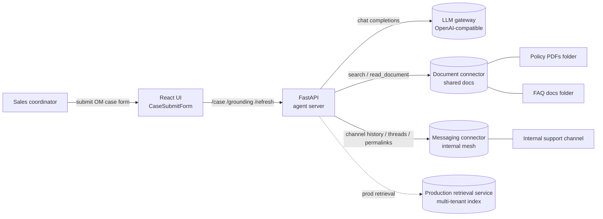
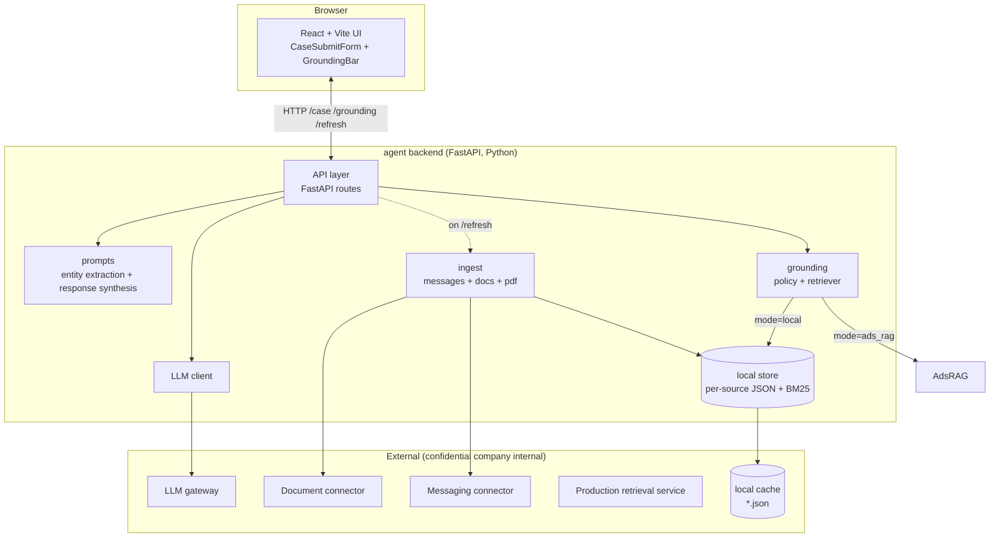
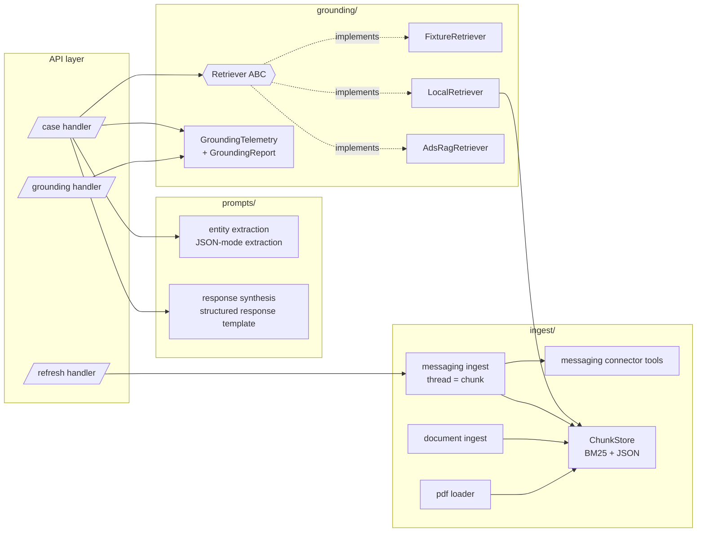
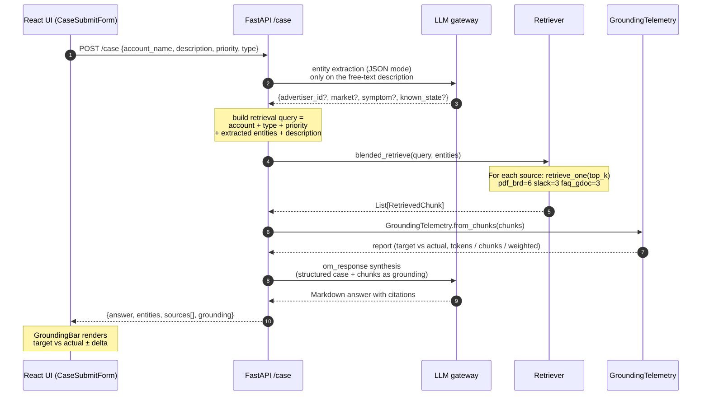
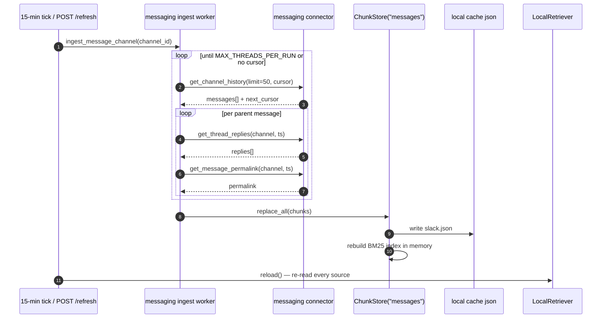
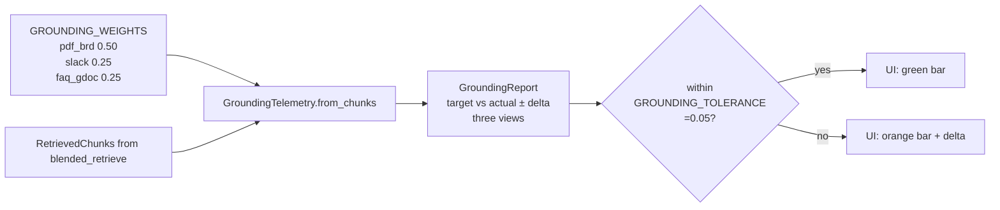
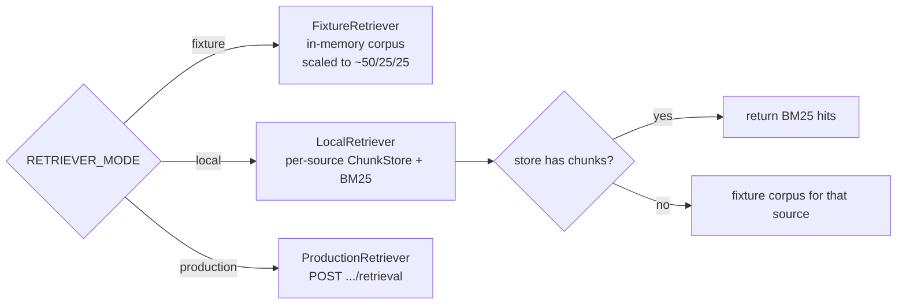
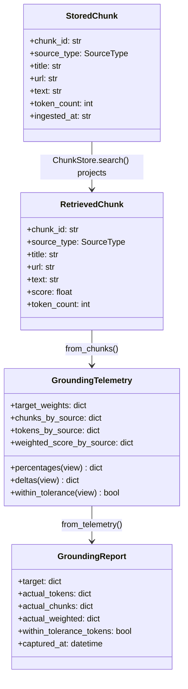
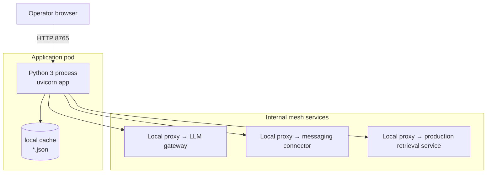

# OM Response Generation Agent — Design Document

Status: Draft v1
Owner: confidential company
Last updated: 2026-06-02

> Companion document to [`README.md`](./README.md). The README covers *how to
> run and wire* the agent; this doc covers *why it is shaped this way*.

---

## 1. Problem statement

confidential company sales coordinators triage advertiser escalations of the form:
*"Advertiser X has an active order line but their campaign won't launch — why?"*

Today the answer lives in three different places:

| Source | Owner | Properties |
|---|---|---|
| 6 policy PDFs | Product / Operations | Canonical, slow-changing, authoritative |
| General inquiry FAQ (shared docs) | Operations team | Curated short-form answers |
| Internal support channel history | Support coordinators | Real edge cases + actual resolutions |

Coordinators have to read all three to answer one ticket. The agent presents
a **case-submit form** (account name, case description, priority, type), then
produces a single grounded response **and proves** which sources it actually
used, at what ratio.

### Case-submit form

The UI is *not* a chat panel — it is a structured case-submit form modeled on
the existing OM intake template:

| Field | UI control | Backing type |
|---|---|---|
| Account name | text input (≤ 200 chars) | `str` |
| Case description | textarea (≤ 4000 chars) | `str` |
| Priority | select | `Critical` \| `High` \| `Medium` \| `Low` |
| Type | select | `Launch blocker` \| `Billing` \| `Order line` \| `Creative review` \| `Other` *(values are placeholders pending product confirmation)* |

The structured priority and type values are not only displayed back in the
generated response — they are concatenated into the retrieval query so BM25
weighting picks up the user-declared category, which improves retrieval for
the Slack slice where coordinators rarely repeat the exact symptom phrasing.

### Goals

1. **Single grounded answer** per escalation, citing every source chunk used.
2. **Declared grounding policy** (50% BRD / 25% Slack / 25% FAQ) with live
   measurement of the *actual* mix per response.
3. **Ship-today path** — UI + end-to-end flow runs against fixtures before any
   real source is wired.
4. **Incremental wiring** — Slack can be live while BRD/FAQ are still stubs,
   without breaking grounding telemetry.
5. **Production handoff** — swap fixture/local retriever for the production
   retrieval service without touching the chat path.

### Non-goals (v1)

- Writing back to messaging or CRM systems (read-only triage).
- Auto-resolving the escalation (human is always in the loop).
- Cross-tenant retrieval — this service uses its own isolated retrieval scope.
- Embedding-based retrieval in the local mode (we use BM25 to avoid an
  embedding pipeline dependency for the demo path).

---

## 2. System context (C4 — Level 1)

**Trust boundaries**

- All external calls leave the agent process through confidential company-
  internal connectors: the LLM gateway, document connector, messaging
  connector, or the production retrieval service. No direct calls to
  third-party APIs are made from this service.
- Auth lives in the connectors and model gateway; the agent holds no
  production secrets in `RETRIEVER_MODE = "fixture"` or `"local"`.

---

## 3. Container view (C4 — Level 2)

Three colour-coded loops:

| Loop | Trigger | Latency budget | Components touched |
|---|---|---|---|
| **Query** | `POST /case` | < 5 s p95 | Server → Prompts → Retriever → LLM gateway → Telemetry |
| **Ingest** | 15-min tick or `POST /refresh` | seconds–minutes | Ingest → docs/messages → Store |
| **Telemetry** | `GET /grounding` (UI polls) | < 100 ms | Server → in-memory `_last_grounding` |

---

## 4. Component view (C4 — Level 3)

### Key contracts

- `Retriever.retrieve_one(request, source, top_k)` → `list[RetrievedChunk]`
  Per-source retrieval; blending happens in `Retriever.blended_retrieve` so
  ratio enforcement is owned by one place.
- `GroundingTelemetry.from_chunks(chunks)` → measures what actually got in.
- `ChunkStore(source).search(query, top_k)` → BM25 over a per-source JSON
  file; one store per source so partial wiring is safe.

---

## 5. Query path — sequence

Two LLM calls per turn (entity extraction + synthesis) are intentional. The
entity step is *narrower* than in a chat-style agent: the form already gives
us account name, priority, and type as structured inputs, so entity
extraction only mines the free-text description for the residual signals
(`advertiser_id`, `market`, `symptom`, `known_state`).

The retrieval query is built deterministically from the form fields plus the
extracted entities, not just the raw description — this is what lets the
user-declared `type` and `priority` actually steer BM25 scoring.

---

## 6. Ingestion path — sequence

**Why replace, not upsert.** BM25 is cheap to rebuild and message channels have
a retention window; full replace avoids stale chunks lingering after a thread
is deleted upstream.

**Why thread-as-chunk.** Coordinators reason in threads (issue + resolution).
A single retrieval unit per thread keeps the resolution attached to the
question, instead of returning a question-only chunk that scores well on the
query but doesn't help.

---

## 7. Grounding policy & telemetry

The grounding policy is a *declared target* + *measured actual* + *tolerance*:

Three views are exposed so reviewers can pick the definition of "grounding
contribution" they trust:

| View | What it measures | When to trust |
|---|---|---|
| `tokens` (default) | Share of final prompt context per source | Most honest — this is what the LLM actually sees |
| `chunks` | Number of chunks per source | Easier to explain to non-engineers |
| `weighted` | Σ(score × target_weight) per source | Useful for tuning retrieval, less useful as an explanation |

`within_tolerance_tokens` is the single boolean the UI flips on when the live
mix is honoring the declared policy within ±5%.

---

## 8. Retriever modes & graceful degradation

The fixture-fallback in `LocalRetriever` is the linchpin of the incremental
rollout story: ship Slack first, BRD/FAQ stay on fixtures, the grounding bar
keeps showing target vs actual the whole time.

`ProductionRetriever` is intentionally a `NotImplementedError` today — see §11.

---

## 9. Data model

`StoredChunk` carries `ingested_at` for retention/freshness; `RetrievedChunk`
adds `score` and is what the prompt + telemetry layer sees.

---

## 10. Deployment view

All confidential company-internal hops are reached via a local sidecar proxy.
The service follows an existing internal deployment pattern, so standard SRE
operational practices already apply.

---

## 11. Failure modes & fallbacks

| Failure | Detection | Fallback |
|---|---|---|
| LLM entity extraction returns non-JSON | `json.JSONDecodeError` in entity extraction | log + fall back to `{}` entities; retrieval still runs on the form fields + description |
| Required form field missing/empty | Pydantic 422 on `CaseRequest` | UI surfaces field-level error; no LLM/retrieval call is made |
| LLM synthesis 5xx | `Exception` in synthesis | `HTTPException(502)` to caller — UI shows error toast, no partial answer |
| Messaging connector error | tool returns `{"error": ...}` | log warning, skip that page; partial message ingest is fine |
| Slack store empty | `ChunkStore.search` returns `[]` | `LocalRetriever` falls back to fixture corpus for that source |
| Document connector unimplemented | stub returns `[]` | BRD/FAQ falls back to fixture corpus; grounding bar still rendered |
| Production retrieval not onboarded | `ProductionRetriever` raises `NotImplementedError` | refuse to start with `RETRIEVER_MODE = "production"` until onboarded |
| Grounding outside tolerance | `within_tolerance_tokens == False` | UI bar flips orange + shows ± delta; no auto-block (operator decides) |

---

## 12. Security & privacy

- **No raw advertiser id in external-facing drafts** — enforced in the
  `OM_RESPONSE_SYSTEM` prompt and reinforced by the UI which renders the
  agent's structured response verbatim.
- **No production credentials in the agent process** for `fixture` / `local`
  modes; message connector auth lives in the connector service. Production
  credentials are only required for the production retrieval path when that
  mode is enabled.
- **Logging** — message bodies are not logged; only counts, ids, and error
  reasons.
- **Document connector gating** — backend access is approval-gated. The
  document client is a stub until that review lands; flipping
  `RETRIEVER_MODE` off `fixture` before approvals are complete is a no-op
  for BRD/FAQ rather than a leak.

---

## 13. Extension points

| Want to… | Change |
|---|---|
| Add a fourth source | Add to `SourceType` + `GROUNDING_WEIGHTS` + `PER_SOURCE_TOP_K`; implement `retrieve_one` for the new source; the telemetry layer needs no changes. |
| Change form fields | Edit `CaseRequest` in `server/schemas.py` + `CasePriority` / `CaseType` literals; mirror in `ui/src/types.ts` + `CaseSubmitForm.tsx`; update `_case_to_retrieval_query` if the field should influence retrieval. |
| Swap BM25 for embeddings (local) | Replace `ChunkStore.search` body; `RetrievedChunk` shape is unchanged. |
| Move to production retrieval | Implement `ProductionRetriever.retrieve_one` against the production retrieval API; flip `RETRIEVER_MODE`. |
| Stream responses to the UI | Convert `/case` to SSE; `GroundingBar` already polls `/grounding` independently. |
| Add a feedback loop | New `/feedback` endpoint that writes `{chunk_id, helpful_bool}`; feed into a re-rank layer above `Retriever`. |

---

## 14. Open questions

1. **BRD freshness** — BRD PDFs change quarterly; do we want a "BRD updated"
   banner in the UI, surfaced from the document connector's `updated_at`?
2. **Messaging scope creep** — the support channel is high-volume. Do we want
   per-channel weights so we can add a second channel without re-tuning?
3. **Prod retrieval SLO** — what's the agreed p95 for `ProductionRetriever`? The
   current `< 5 s p95` query budget assumes ≤ 1 s for blended retrieval.
4. **Audit log** — every escalation eventually becomes a customer-facing
   answer. Do we persist `{query, entities, chunks_used, answer, grounding}`
   for review, and if so, where (object storage? CRM attachment?).

---

