# OM Response Generation Agent — Design Document

Status: Draft v3
Owner: confidential company
Last updated: 2026-06-06
> Companion document to `README.md`. The README covers *how to run and wire* the agent;
> this doc covers *why it is shaped this way*.
>
> **v2 changes:** Added **Case History** as a fourth knowledge source (§2–§13).
> Grounding policy updated from three sources to four. All affected diagrams,
> sequences, data models, failure modes, and extension points updated accordingly.
>
> **v3 changes:** Added **§15 — AI Response Quality Improvement Strategy**: a
> phased, measurable roadmap covering retrieval, generation, feedback, evaluation,
> and continuous learning — fully wired to the existing architecture.

---

## 1. Problem statement

confidential company sales coordinators triage advertiser escalations of the form:
*"Advertiser X has an active order line but their campaign won't launch — why?"*

Today the answer lives in **four** different places:

| Source                             | Owner                 | Properties                                                       |
| ---------------------------------- | --------------------- | ---------------------------------------------------------------- |
| 6 policy PDFs (BRD)                | Product / Operations  | Canonical, slow-changing, authoritative                          |
| General inquiry FAQ (shared docs)  | Operations team       | Curated short-form answers                                       |
| Internal support channel history   | Support coordinators  | Real edge cases + actual resolutions (recent)                    |
| **Resolved case history (CRM/OM)** | **CRM / OM platform** | **Structured past escalations: symptom → root cause → fix path**|

Coordinators have to read all four to answer one ticket. The agent presents
a **case-submit form** (account name, case description, priority, type), then
produces a single grounded response **and proves** which sources it actually
used, at what ratio.

### Case-submit form

The UI is *not* a chat panel — it is a structured case-submit form modeled on
the existing OM intake template:

| Field            | UI control               | Backing type                                                                                                                           |
| ---------------- | ------------------------ | -------------------------------------------------------------------------------------------------------------------------------------- |
| Account name     | text input (≤ 200 chars) | `str`                                                                                                                                  |
| Case description | textarea (≤ 4000 chars)  | `str`                                                                                                                                  |
| Priority         | select                   | `Critical` \| `High` \| `Medium` \| `Low`                                                                                              |
| Type             | select                   | `Launch blocker` \| `Billing` \| `Order line` \| `Creative review` \| `Other` *(values are placeholders pending product confirmation)* |

The structured priority and type values are concatenated into the retrieval
query so BM25 weighting picks up the user-declared category. This is
especially useful for the case history slice, where symptom phrasing in
resolved cases often matches the form's `type` vocabulary exactly.

### Goals

1. **Single grounded answer** per escalation, citing every source chunk used.
2. **Declared grounding policy** (40% BRD / 20% Slack / 20% FAQ / 20% Case History)
   with live measurement of the *actual* mix per response.
3. **Ship-today path** — UI + end-to-end flow runs against fixtures before any
   real source is wired.
4. **Incremental wiring** — each source can go live independently without
   breaking grounding telemetry.
5. **Production handoff** — swap fixture/local retriever for the production
   retrieval service without touching the chat path.

### Non-goals (v1)

- Writing back to messaging or CRM systems (read-only triage).
- Auto-resolving the escalation (human is always in the loop).
- Cross-tenant retrieval — this service uses its own isolated retrieval scope.
- Embedding-based retrieval in the local mode (we use BM25 to avoid an
  embedding pipeline dependency for the demo path).

---

## 2. System context (C4 — Level 1)

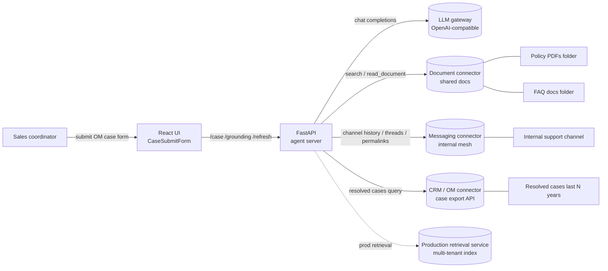

**Trust boundaries**

All external calls leave the agent process through confidential company-internal
connectors. Auth lives in the connectors and model gateway; the agent holds no
production secrets in `RETRIEVER_MODE = "fixture"` or `"local"`.

---

## 3. Container view (C4 — Level 2)

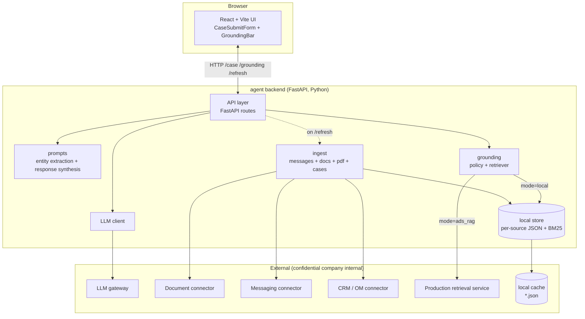

Three colour-coded loops (unchanged from v1):

| Loop          | Trigger                        | Latency budget  | Components touched                                     |
| ------------- | ------------------------------ | --------------- | ------------------------------------------------------ |
| **Query**     | `POST /case`                   | < 5 s p95       | Server → Prompts → Retriever → LLM gateway → Telemetry |
| **Ingest**    | 15-min tick or `POST /refresh` | seconds–minutes | Ingest → docs/messages/cases → Store                  |
| **Telemetry** | `GET /grounding` (UI polls)    | < 100 ms        | Server → in-memory `_last_grounding`                   |

---

## 4. Component view (C4 — Level 3)

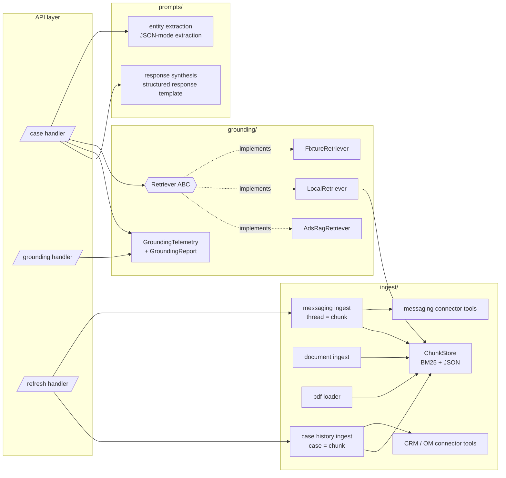

### Key contracts (updated)

- `Retriever.retrieve_one(request, source, top_k)` → `list[RetrievedChunk]`
  Per-source retrieval; blending happens in `Retriever.blended_retrieve`.
- `GroundingTelemetry.from_chunks(chunks)` → measures what actually got in.
- `ChunkStore(source).search(query, top_k)` → BM25 over a per-source JSON file;
  now four stores: `pdf_brd`, `slack`, `faq_gdoc`, **`case_history`**.

---

## 5. Query path — sequence

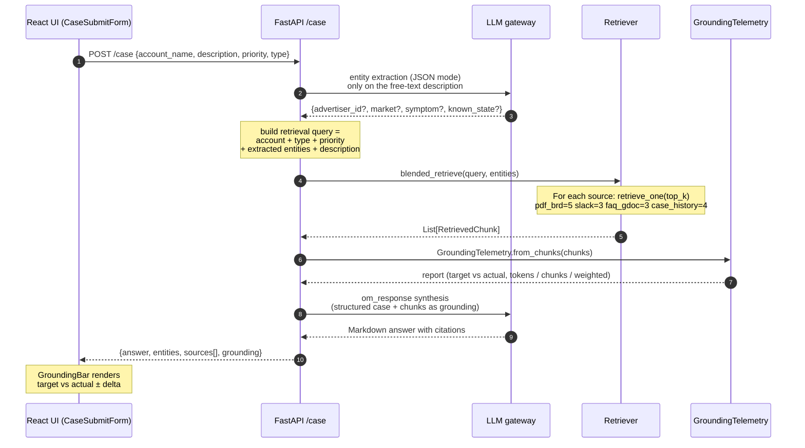

Two LLM calls per turn remain intentional. The entity step mines the free-text
description for residual signals (`advertiser_id`, `market`, `symptom`,
`known_state`). For case history retrieval, `symptom` and `case_type` are
especially valuable signals: a `symptom` of `"delivery_blocked"` steers BM25
scoring directly toward historically similar resolved cases.

---

## 6. Ingestion path — sequence

### 6a. Messaging ingest (unchanged)

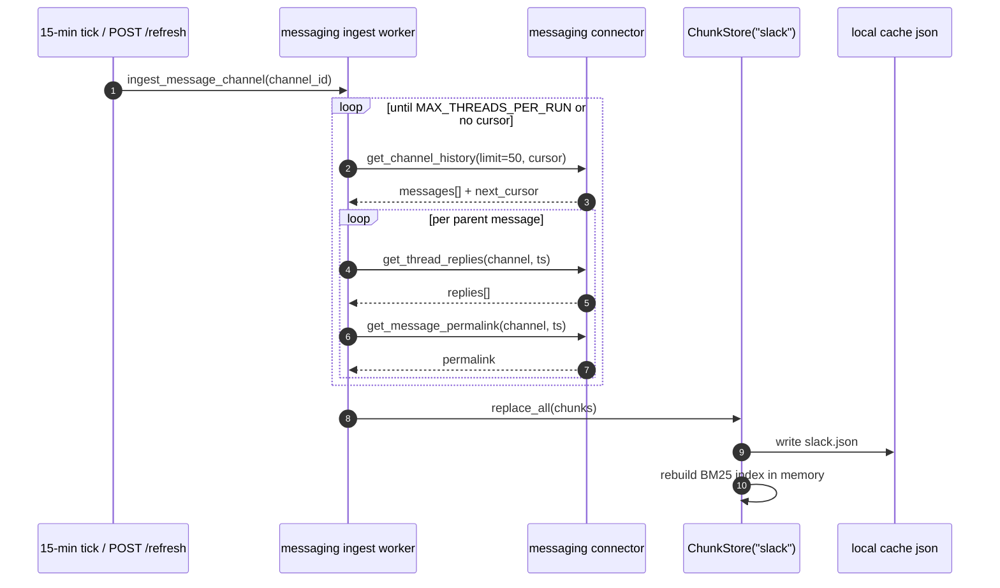

### 6b. Case History ingest (new)

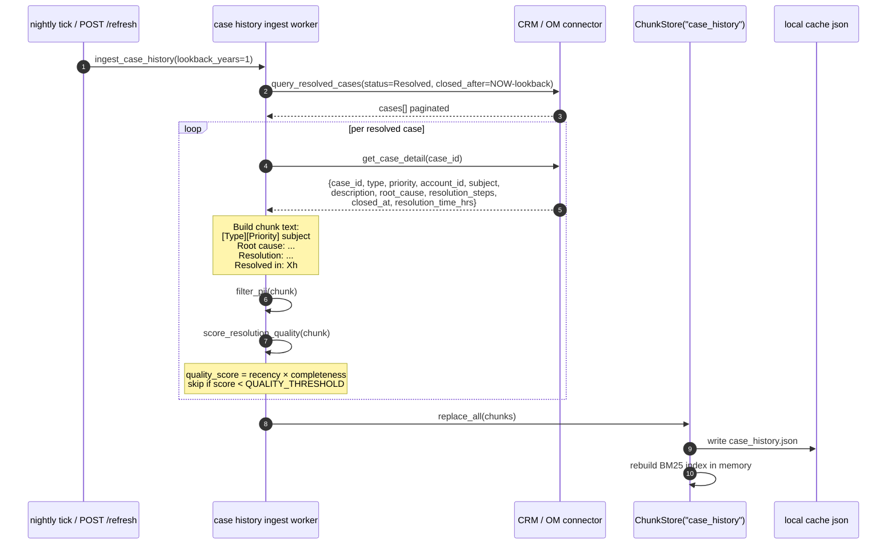

**Chunking strategy for case history.** Each resolved case becomes one chunk,
preserving the symptom ↔ root-cause ↔ resolution triplet in a single retrieval
unit. Splitting a case across chunks would risk returning a symptom description
without its resolution — the same reasoning that drives thread-as-chunk for Slack.

**PII filtering before storage.** The `filter_pii` step strips or hashes
`account_id`, advertiser names, and any free-text advertiser identifiers from
the chunk text before writing to `case_history.json`. The `case_id` and
`account_id` are retained as metadata fields (not indexed by BM25) so the UI
can link to the source record without surfacing PII in the generated answer.

**Quality filtering.** A `quality_score` is computed as:

```
quality_score = recency_weight(closed_at) × completeness(root_cause, resolution_steps)
```

- `recency_weight`: cases closed in the last 90 days score 1.0; weight decays
  linearly to 0.5 at 12 months (configurable via `CASE_RECENCY_HALF_LIFE_DAYS`).
- `completeness`: 1.0 if both `root_cause` and `resolution_steps` are non-empty;
  0.5 if only one is present; 0.0 otherwise (chunk is dropped).

Cases below `QUALITY_THRESHOLD = 0.3` are skipped, preventing low-signal
"resolved by workaround — see account team" cases from diluting retrieval.

**Ingest cadence.** Case history runs on a **nightly tick** (not 15-min), because
CRM data changes on a daily resolution cycle and the dataset is larger than Slack.
A `/refresh?source=case_history` call can force a manual re-ingest.

---

## 7. Grounding policy & telemetry

The grounding policy is a *declared target* + *measured actual* + *tolerance*.

### 7a. Updated source weights

| Source           | v1 target | v2 target | Rationale                                                                         |
| ---------------- | --------- | --------- | --------------------------------------------------------------------------------- |
| `pdf_brd`        | 50%       | **40%**   | Still the most authoritative source; slightly reduced to make room for case history |
| `slack`          | 25%       | **20%**   | Recent channel signals; reduced proportionally                                    |
| `faq_gdoc`       | 25%       | **20%**   | Curated answers; reduced proportionally                                           |
| `case_history`   | —         | **20%**   | Historical resolved cases — empirical precedent for similar symptoms              |

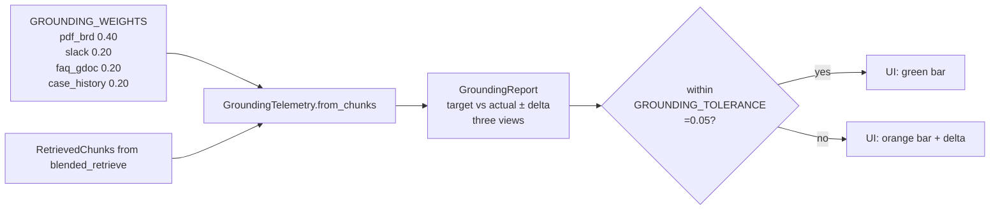

### 7b. Type-conditional weight overrides (recommended)

A fixed 40/20/20/20 split is not optimal for every case type. The case history
source is especially valuable for `Launch blocker` and `Order line` cases (high
volume of historical precedents), while policy PDFs dominate for `Billing` cases.

Recommended `GROUNDING_WEIGHTS_BY_TYPE` override map:

| Case type        | `pdf_brd` | `slack` | `faq_gdoc` | `case_history` |
| ---------------- | --------- | ------- | ---------- | -------------- |
| Launch blocker   | 0.35      | 0.20    | 0.15       | **0.30**       |
| Billing          | 0.55      | 0.10    | 0.20       | 0.15           |
| Order line       | 0.35      | 0.20    | 0.15       | **0.30**       |
| Creative review  | 0.30      | 0.15    | 0.35       | 0.20           |
| Other            | 0.40      | 0.20    | 0.20       | 0.20           |

These are initial recommendations to be tuned once the case history store
has been live for 30+ days and retrieval telemetry can be compared against
coordinator resolution times.

### 7c. Telemetry views (unchanged)

| View               | What it measures                         | When to trust                                |
| ------------------ | ---------------------------------------- | -------------------------------------------- |
| `tokens` (default) | Share of final prompt context per source | Most honest — this is what the LLM sees      |
| `chunks`           | Number of chunks per source              | Easier to explain to non-engineers           |
| `weighted`         | Σ(score × target\_weight) per source     | Useful for tuning retrieval                  |

`within_tolerance_tokens` is the single boolean the UI flips on when the live
mix is honoring the declared policy within ±5%.

---

## 8. Retriever modes & graceful degradation

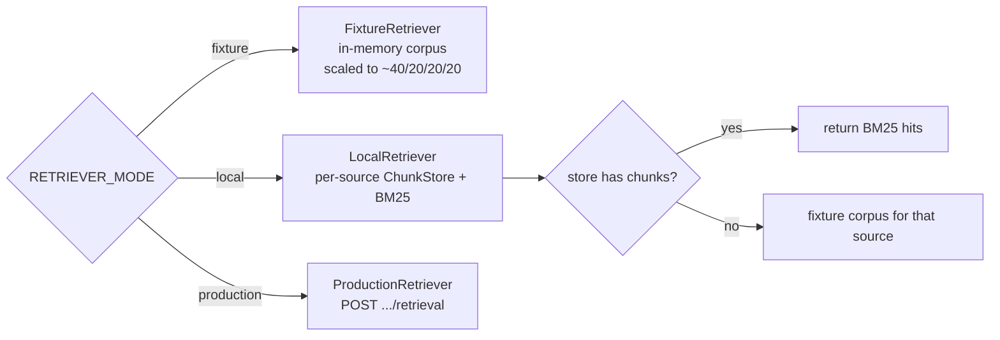

The fixture-fallback in `LocalRetriever` applies to all four sources including
`case_history`. During the rollout window before the CRM connector is wired,
case history falls back to a fixture corpus of ~20 synthetic resolved cases
scaled to the 20% target weight, so the grounding bar continues rendering
correctly.

`PER_SOURCE_TOP_K` updated:

```python
PER_SOURCE_TOP_K = {
    "pdf_brd":       5,   # was 6
    "slack":         3,
    "faq_gdoc":      3,
    "case_history":  4,   # new
}
```

Total chunks in context: **15** (was 12). The `pdf_brd` top-k is reduced by 1
to keep total prompt context growth modest while accommodating the new source.

---

## 9. Data model

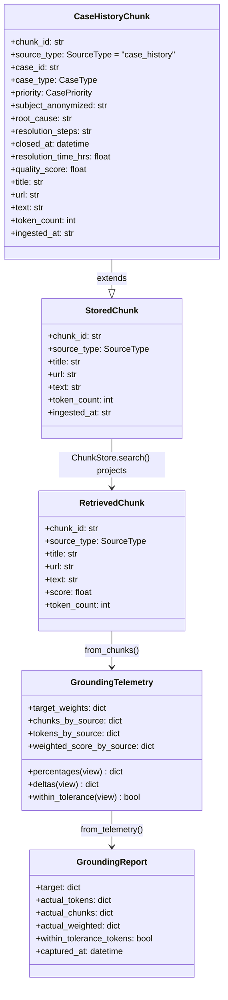

`CaseHistoryChunk` extends `StoredChunk` with structured case metadata
(`case_id`, `case_type`, `closed_at`, `resolution_time_hrs`, `quality_score`).
These fields are carried through to `RetrievedChunk` as opaque metadata so the
synthesis prompt and UI citation panel can render: *"Resolved in 4.5h — see
Case #XXXXX"* without exposing raw `account_id`.

`SourceType` enum updated:

```python
class SourceType(str, Enum):
    PDF_BRD      = "pdf_brd"
    SLACK        = "slack"
    FAQ_GDOC     = "faq_gdoc"
    CASE_HISTORY = "case_history"   # new
```

---

## 10. Deployment view

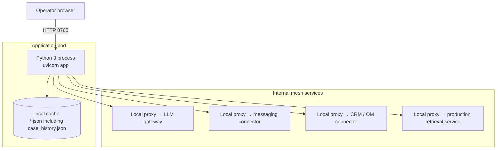

All confidential company-internal hops are reached via a local sidecar proxy.
The CRM connector follows the same proxy pattern as the messaging connector.

---

## 11. Failure modes & fallbacks

| Failure                                       | Detection                                               | Fallback                                                                                         |
| --------------------------------------------- | ------------------------------------------------------- | ------------------------------------------------------------------------------------------------ |
| LLM entity extraction returns non-JSON        | `json.JSONDecodeError`                                  | log + fall back to `{}` entities; retrieval still runs on form fields + description              |
| Required form field missing/empty             | Pydantic 422 on `CaseRequest`                           | UI surfaces field-level error; no LLM/retrieval call made                                        |
| LLM synthesis 5xx                             | `Exception` in synthesis                                | `HTTPException(502)` to caller — UI shows error toast                                            |
| Messaging connector error                     | tool returns `{"error": ...}`                           | log warning, skip that page; partial ingest fine                                                 |
| Slack store empty                             | `ChunkStore.search` returns `[]`                        | `LocalRetriever` falls back to fixture corpus for that source                                    |
| Document connector unimplemented              | stub returns `[]`                                       | BRD/FAQ falls back to fixture corpus                                                             |
| **CRM connector error during ingest**         | **`Exception` in `ingest_case_history`**                | **log warning, retain last successful `case_history.json`; stale data is better than no data**  |
| **CRM connector returns no resolved cases**   | **`len(cases) == 0` after filter**                      | **log warning, skip store replace (retain prior snapshot); alert if this persists > 2 days**    |
| **All case history chunks below quality threshold** | **`quality_score < QUALITY_THRESHOLD` for all** | **write empty store; `LocalRetriever` falls back to fixture corpus for `case_history`**         |
| **Case history store stale (> 48 h)**         | **`ingested_at` check on store load**                   | **UI shows staleness badge on case history bar segment; no auto-block**                          |
| Production retrieval not onboarded            | `ProductionRetriever` raises `NotImplementedError`      | refuse to start with `RETRIEVER_MODE = "production"` until onboarded                            |
| Grounding outside tolerance                   | `within_tolerance_tokens == False`                      | UI bar flips orange + shows ± delta; operator decides                                            |

---

## 12. Security & privacy

- **No raw advertiser id in external-facing drafts** — enforced in the
  `OM_RESPONSE_SYSTEM` prompt.
- **Case history PII handling** — `account_id` and advertiser names are stripped
  from the BM25-indexed chunk text during ingest (§6b). They are retained as
  non-indexed metadata solely for UI deep-links. The synthesis prompt is
  explicitly instructed not to reproduce metadata fields verbatim.
- **Case history access gating** — the CRM connector requires a separate
  approval scope (`case_history_read`). In `fixture` / `local` modes the
  connector is not called; flipping `RETRIEVER_MODE` without the approved scope
  is a no-op for `case_history` rather than a data leak.
- **No production credentials** in the agent process for `fixture` / `local` modes.
- **Logging** — message bodies and case descriptions are not logged; only counts,
  IDs, quality scores, and error reasons.

---

## 13. Extension points

| Want to…                              | Change                                                                                                                                                                                                           |
| ------------------------------------- | ---------------------------------------------------------------------------------------------------------------------------------------------------------------------------------------------------------------- |
| Add a fifth source                    | Add to `SourceType` + `GROUNDING_WEIGHTS` + `PER_SOURCE_TOP_K`; implement `retrieve_one` for the new source; telemetry layer needs no changes.                                                                  |
| Change form fields                    | Edit `CaseRequest` in `server/schemas.py` + `CasePriority` / `CaseType` literals; mirror in `ui/src/types.ts` + `CaseSubmitForm.tsx`; update `_case_to_retrieval_query` if the field should influence retrieval. |
| Swap BM25 for embeddings (local)      | Replace `ChunkStore.search` body; `RetrievedChunk` shape is unchanged.                                                                                                                                           |
| Move to production retrieval          | Implement `ProductionRetriever.retrieve_one` against the production retrieval API; flip `RETRIEVER_MODE`.                                                                                                        |
| Stream responses to the UI            | Convert `/case` to SSE; `GroundingBar` already polls `/grounding` independently.                                                                                                                                 |
| Add a feedback loop                   | New `/feedback` endpoint that writes `{chunk_id, helpful_bool}`; feed into a re-rank layer above `Retriever`.                                                                                                   |
| **Extend case history lookback**      | **Increase `CASE_LOOKBACK_YEARS` env var (default `1`); re-run nightly ingest. Longer lookbacks require recency weight re-calibration (see §6b quality scoring).**                                            |
| **Filter case history by case type**  | **Add `CASE_HISTORY_TYPE_FILTER` env var (default `all`); pass as query param to CRM connector. Allows scoping the store to e.g. `Launch blocker` only for a focused deployment.**                             |
| **Surface resolution time in the UI** | **`CaseHistoryChunk.resolution_time_hrs` is already in the data model; expose it in the citation card component alongside the case deep-link.**                                                                 |
| **Re-rank case history by recency**   | **Add a `recency_boost` multiplier to `ChunkStore("case_history").search()` that scales BM25 scores by `recency_weight(closed_at)`. This lets the retriever prefer recent resolutions without a full embedding pipeline.** |

---

## 14. Open questions

1. **BRD freshness** — BRD PDFs change quarterly; do we want a "BRD updated"
   banner in the UI, surfaced from the document connector's `updated_at`?
2. **Messaging scope creep** — the support channel is high-volume. Do we want
   per-channel weights so we can add a second channel without re-tuning?
3. **Prod retrieval SLO** — what's the agreed p95 for `ProductionRetriever`? The
   current `< 5 s p95` query budget assumes ≤ 1 s for blended retrieval.
4. **Audit log** — every escalation eventually becomes a customer-facing answer.
   Do we persist `{query, entities, chunks_used, answer, grounding}` for review,
   and if so, where (object storage? CRM attachment?).
5. **Case history lookback window** — defaulting to 1 year. Should this be
   case-type-specific? (e.g., `Billing` patterns may be stable over 2–3 years;
   `Launch blocker` patterns may shift quarterly with platform changes.)
6. **Case history write-back** — when a coordinator resolves a new escalation
   using this agent, should the outcome be written back to the CRM as a resolved
   case, feeding the next ingestion cycle? This is explicitly out of scope for v1
   (read-only triage) but is the natural v2 flywheel.
7. **Quality threshold calibration** — `QUALITY_THRESHOLD = 0.3` is a starting
   point. Once the store is live, plot retrieval hit rate vs. threshold value
   across 30 days of production traffic to find the Pareto-optimal threshold.

---

## 15. AI Response Quality Improvement Strategy

This section defines *how the agent gets better over time* — not just how it
works on day one. It is structured as three overlapping phases, each with
concrete implementation steps, measurable success criteria, and explicit
tie-ins to the existing architecture.

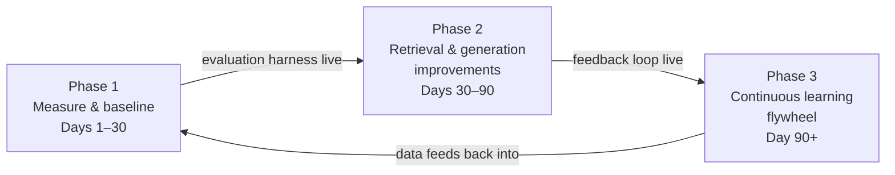

The phases are intentionally sequential in their *dependencies* but can run in
parallel in practice: Phase 1 instrumentation must land before Phase 2 tuning
is meaningful; Phase 2 feedback infrastructure must land before Phase 3
retraining is possible.

---

### 15.1 Phase 1 — Measure & Baseline (Days 1–30)

> You cannot improve what you cannot measure. Before touching retrieval or
> prompts, instrument everything and establish a ground truth.

#### 15.1.1 Golden evaluation set

Build a set of **30–50 manually curated (case description → expected answer
attributes)** pairs, drawn from real past escalations. Each golden example
captures:

| Field                    | Description                                                  |
| ------------------------ | ------------------------------------------------------------ |
| `case_description`       | Real or lightly anonymized coordinator input                 |
| `expected_sources`       | Which source types should appear in the answer (`pdf_brd`, `case_history`, etc.) |
| `expected_entities`      | `{symptom, case_type, market}` the extractor should find    |
| `must_contain`           | Key facts that must appear in the answer (e.g. "creative approval required") |
| `must_not_contain`       | Facts that should never appear (e.g. raw account names, hallucinated policy numbers) |
| `resolution_path`        | The correct fix path in plain language — used for LLM-as-judge scoring |

Run this set on every code change via a CI evaluation job. A regression is any
drop of > 3 percentage points on the composite score (see §15.1.3).

#### 15.1.2 Retrieval evaluation metrics

For each golden example, measure:

| Metric                  | Definition                                                           | Target    |
| ----------------------- | -------------------------------------------------------------------- | --------- |
| **Recall@K**            | Fraction of expected source types present in top-K retrieved chunks  | ≥ 0.85    |
| **MRR** (Mean Reciprocal Rank) | How high the first relevant chunk ranks per query             | ≥ 0.70    |
| **Grounding adherence** | `within_tolerance_tokens` (already in §7) across all golden cases   | ≥ 90%     |
| **Entity extraction accuracy** | F1 on `{symptom, case_type, market}` vs. golden labels      | ≥ 0.80    |

These metrics run against the existing `GroundingTelemetry` output and the
`RetrievedChunk` list — no new infrastructure is required.

#### 15.1.3 Generation evaluation metrics

Use an **LLM-as-judge** call (a separate synthesis evaluation prompt, not the
main synthesis prompt) to score each generated answer against its golden
`resolution_path`. Score on a 1–5 rubric:

| Dimension          | What it tests                                                           |
| ------------------ | ----------------------------------------------------------------------- |
| **Factual accuracy** | Does the answer contradict any retrieved source or the golden resolution? |
| **Completeness**   | Are all required fix steps present?                                     |
| **Citation fidelity** | Does every cited fact map to a real retrieved chunk?                 |
| **Conciseness**    | Is the answer free of repetition and padding?                           |
| **Tone**           | Does it read as a professional coordinator response?                    |

Composite score = weighted average (accuracy × 0.35, completeness × 0.25,
citation fidelity × 0.20, conciseness × 0.10, tone × 0.10). Minimum
acceptable composite: **3.8 / 5.0**.

#### 15.1.4 Production telemetry baseline

Before any improvements land, record 30-day baseline values for:

- Median / p95 end-to-end latency (`POST /case`)
- Actual grounding mix per case type (from `GroundingReport`)
- Entity extraction fallback rate (how often `entities == {}`)
- Coordinator edit rate (% of answers modified before sending — requires a
  lightweight edit-tracking hook in the UI, see §15.2.5)

---

### 15.2 Phase 2 — Retrieval & Generation Improvements (Days 30–90)

Each improvement below has a **dependency** (what must be true before you start),
an **implementation note** tied to the existing architecture, and a **success
criterion** expressed as a delta on a Phase 1 baseline metric.

#### 15.2.1 Hybrid retrieval: BM25 + dense embeddings

**Dependency:** Phase 1 evaluation harness live.

**Problem:** BM25 misses semantic synonyms. A coordinator writing *"ads won't
serve"* won't hit a BRD chunk that says *"delivery blocked pending creative
review"* — same problem, different words.

**Implementation:**

1. Add an embedding model call (e.g. `text-embedding-3-small`) in
   `ChunkStore.search()` alongside the existing BM25 path.
2. Run both independently; merge ranked lists using **Reciprocal Rank Fusion
   (RRF)**: `score_rrf = Σ 1 / (k + rank_i)` where `k = 60`.
3. No change to `RetrievedChunk` shape or `GroundingTelemetry`.

```python
# ChunkStore.search() — hybrid path
def search(self, query: str, top_k: int) -> list[RetrievedChunk]:
    bm25_hits  = self._bm25_search(query, top_k * 2)
    dense_hits = self._dense_search(query, top_k * 2)   # new
    return _reciprocal_rank_fusion(bm25_hits, dense_hits)[:top_k]
```

**Success criterion:** Recall@K improves by ≥ 5 pp on the golden set vs. BM25-only baseline.

#### 15.2.2 Query expansion before retrieval

**Dependency:** None (can run in parallel with 15.2.1).

**Problem:** A coordinator's one-sentence description rarely uses the exact
vocabulary of the policy PDFs or historical cases. Query expansion bridges this
gap before retrieval happens, not after.

**Implementation:** Add a third LLM call — *before* `blended_retrieve` — that
expands the retrieval query into 3 alternative phrasings:

```
System: You are a query expansion assistant for an ad ops support system.
Given a case description, return a JSON array of 3 alternative search queries
that express the same problem using different vocabulary — policy language,
technical terms, and symptom descriptions.
Output only the JSON array.
```

Run retrieval against all 4 queries (original + 3 expansions), union the
results, de-duplicate by `chunk_id`, re-rank by max score. This adds ~200ms
latency but is parallelisable with the entity extraction call (see §15.2.3).

**Success criterion:** MRR improves by ≥ 0.05 on the golden set.

#### 15.2.3 Parallel LLM calls (latency recovery)

**Dependency:** 15.2.2 (adds a third LLM call that would otherwise be serial).

**Problem:** v1 runs entity extraction → retrieval → synthesis serially. With
query expansion added, the naive path is 3 serial LLM calls before synthesis
even starts.

**Implementation:** Run entity extraction and query expansion **in parallel**
using `asyncio.gather`:

```python
entity_task   = asyncio.create_task(extract_entities(description))
expansion_task = asyncio.create_task(expand_query(description, case_type))
entities, expansions = await asyncio.gather(entity_task, expansion_task)
# Then build retrieval query from both, run blended_retrieve, then synthesis
```

Both calls are narrow (JSON mode, < 200 token outputs), so they complete in
~400ms in parallel vs. ~800ms serial. Net cost of adding query expansion: ~0ms
on wall clock.

**Success criterion:** p95 latency ≤ 5s even with query expansion active.

#### 15.2.4 Cross-encoder re-ranking

**Dependency:** 15.2.1 hybrid retrieval live.

**Problem:** Hybrid retrieval returns the top-15 chunks by score, but "top by
score" is not the same as "most useful for this specific case." A cross-encoder
re-ranker scores each (query, chunk) pair jointly, catching relevance signals
that bi-encoder retrieval misses.

**Implementation:**

1. After `blended_retrieve` returns top-15, pass all 15 (query, chunk) pairs
   to a cross-encoder (e.g. Cohere Rerank API, or a local `cross-encoder/ms-marco-MiniLM-L-6-v2`).
2. Re-sort by cross-encoder score; keep the top 12 (respecting `PER_SOURCE_TOP_K`
   minimums per source to preserve grounding policy).
3. `GroundingTelemetry` runs on the final 12 — no change needed there.

**Success criterion:** LLM-as-judge factual accuracy score improves by ≥ 0.2
points (composite) on the golden set vs. pre-reranking.

#### 15.2.5 Coordinator edit tracking (feedback signal)

**Dependency:** Phase 1 baseline coordinator edit rate measured.

**Problem:** The agent has no signal on whether its answers are actually good.
Every time a coordinator edits the answer before sending it to the advertiser,
that edit is a free supervised signal — and currently it is discarded.

**Implementation:**

1. In the UI, wrap the answer display in a `<textarea>` (editable) rather than
   rendered markdown. On submit, diff `original_answer` vs. `submitted_answer`.
2. `POST /feedback` with:
   ```json
   {
     "case_id": "...",
     "chunk_ids_used": ["...", "..."],
     "original_answer": "...",
     "submitted_answer": "...",
     "edit_distance_ratio": 0.12,
     "coordinator_id_hash": "..."
   }
   ```
3. Server writes to `feedback_store.jsonl` (append-only). `edit_distance_ratio`
   is the fraction of characters changed. If > 0.3, the response is flagged as
   "substantially edited" — a strong negative signal.

**Success criterion:** Edit tracking live and capturing data within 2 weeks of
Phase 2 start. Target: coordinator edit rate < 25% at end of Phase 2.

#### 15.2.6 Synthesis prompt hardening

**Dependency:** Phase 1 LLM-as-judge scoring baseline.

**Problem:** The synthesis prompt controls what the LLM does with the retrieved
chunks. Small prompt changes can have large effects on citation fidelity and
hallucination rate.

**Improvements to the `OM_RESPONSE_SYSTEM` prompt:**

| Technique | What to add | Why |
|---|---|---|
| **Explicit grounding instruction** | "Base your answer *only* on the provided source chunks. If a chunk does not support a claim, do not make it." | Reduces hallucination |
| **Citation format enforcement** | "After every factual claim, add a citation in the format `[Source: <source_type>, chunk <chunk_id>]`." | Improves citation fidelity scoring |
| **Contradiction instruction** | "If two chunks contradict each other, surface both positions and note the conflict rather than picking one silently." | Prevents silent hallucination when policy chunks disagree |
| **Resolution path structure** | "Structure your answer as: (1) Likely root cause, (2) Recommended fix steps, (3) Escalation path if fix steps do not resolve." | Improves completeness score |
| **Negative instruction** | "Do not include account names, advertiser IDs, or any PII. Do not speculate beyond the provided sources." | Reinforces PII protection from §12 |

**Success criterion:** Citation fidelity dimension of LLM-as-judge composite
improves by ≥ 0.3 points vs. baseline.

---

### 15.3 Phase 3 — Continuous Learning Flywheel (Day 90+)

> Phase 3 turns the agent from a static system into a self-improving one.
> It requires the feedback infrastructure from §15.2.5 to be live and
> accumulating data.

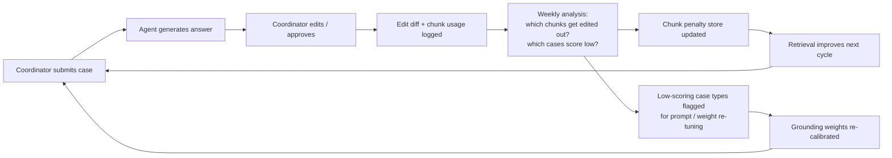

#### 15.3.1 Chunk penalty store

**How it works:** After 30 days of feedback data, run a weekly job:

```python
# For each chunk_id, compute:
# helpful_rate = (approvals where chunk was used) / (total uses)
# If helpful_rate < PENALTY_THRESHOLD (= 0.3):
#   write chunk_id → penalty_multiplier to penalty_store.json
# ChunkStore.search() multiplies BM25/dense score by penalty_multiplier
```

Chunks that are consistently retrieved but then edited out get a score
penalty. Chunks that are retrieved and kept verbatim get a small score boost.
No retraining required — this is a post-retrieval score adjustment only.

**Review cadence:** Weekly automated job; monthly human review of the penalty
store to confirm penalties are semantically sensible (not just rare queries
gaming the stats).

#### 15.3.2 Case-type weight re-calibration

**How it works:** The type-conditional grounding weights in §7b are initial
estimates. After 90 days of production data, recalibrate using actual outcomes:

```
For each case_type:
  actual_edit_rate_by_source = mean(edit_distance_ratio grouped by primary_source_type)
  new_weight[source] ∝ 1 - actual_edit_rate_by_source[source]
```

Sources whose chunks are consistently kept by coordinators get weight
increases; sources whose chunks are consistently edited out get weight
decreases. Re-calibration runs quarterly and requires a human sign-off before
the new `GROUNDING_WEIGHTS_BY_TYPE` config is deployed.

#### 15.3.3 Automated regression detection

**How it works:** Run the golden evaluation set (§15.1.1) nightly in CI. If
composite score drops > 3 pp from the rolling 7-day average:

1. Block the current deploy from promoting to production.
2. File an automatic incident ticket with the diff of the last changed
   prompt / config / ingest run.
3. Page the on-call engineer with the failing golden examples.

This prevents silent regressions from prompt changes, ingest data quality
shifts (e.g. a bad BRD PDF update), or LLM gateway model version changes.

#### 15.3.4 Case history write-back (v2 flywheel)

**Dependency:** §14 open question #6 resolved; CRM write permission approved.

**How it works:** When a coordinator submits an answer (edited or approved),
write a structured resolution record back to the CRM:

```json
{
  "source_case_id": "...",
  "agent_answer_hash": "...",
  "coordinator_edit_ratio": 0.08,
  "chunks_used": ["brd_chunk_003", "case_history_chunk_019"],
  "resolution_confirmed": true,
  "closed_at": "2026-07-15T14:32:00Z"
}
```

This record is then picked up by the next nightly `ingest_case_history` run,
creating a compounding flywheel: each resolved escalation enriches the case
history store, which improves retrieval for the next similar case.

**Safeguard:** Only write back cases where `coordinator_edit_ratio < 0.2` —
heavily-edited answers are not reliable enough to serve as future training
examples.

---

### 15.4 Quality improvement roadmap summary

| Phase | Initiative | Owner | Metric target | Timeline |
|---|---|---|---|---|
| 1 | Golden evaluation set + CI job | Eng | Harness live | Day 7 |
| 1 | LLM-as-judge scoring pipeline | Eng | Composite baseline captured | Day 14 |
| 1 | Production telemetry baseline | Eng | Edit rate + latency baseline | Day 30 |
| 2 | Hybrid retrieval (BM25 + dense) | Eng | Recall@K ≥ 0.85 | Day 45 |
| 2 | Query expansion (parallel) | Eng | MRR ≥ 0.70 | Day 45 |
| 2 | Cross-encoder re-ranking | Eng | Factual accuracy +0.2 pts | Day 60 |
| 2 | Coordinator edit tracking | Eng + PM | Edit rate baseline captured | Day 50 |
| 2 | Synthesis prompt hardening | Eng | Citation fidelity +0.3 pts | Day 40 |
| 3 | Chunk penalty store | Eng | Retrieval quality stable or improving | Day 100 |
| 3 | Case-type weight re-calibration | Eng + Ops | Edit rate < 20% | Day 120 |
| 3 | Automated regression detection | Eng | Zero silent regressions | Day 90 |
| 3 | Case history write-back | Eng + Legal | Flywheel active | Day 150 |

**North star metric:** Coordinator edit rate < 15% at Day 180, meaning 85% of
agent answers are sent to advertisers without modification. This is the single
number that best captures whether the AI response quality is fit for purpose.
