# OM Response Generation Agent — Design Document

Status: Draft v5
Owner: confidential company
Last updated: 2026-06-06
> Companion document to `README.md`. The README covers *how to run and wire* the agent;
> this doc covers *why it is shaped this way*.
>
> **v2 changes:** Added **Case History** as a fourth knowledge source (§2–§13).
> Grounding policy updated from three sources to four. All affected diagrams,
> sequences, data models, failure modes, and extension points updated accordingly.
>
> **v3 changes:** Added **§15 — AI Response Quality Improvement Strategy**: a
> phased, measurable roadmap covering retrieval, generation, feedback, evaluation,
> and continuous learning — fully wired to the existing architecture.
>
> **v4 changes:** Redesign pass driven by **eight identified production failure
> modes** (knowledge quality, retrieval precision, feedback cold start, human
> adoption, grounding rigidity, PII/compliance, evaluation drift, org process).
> New components: KnowledgeValidator, ConfidenceScorer, KnowledgeHealthMonitor,
> AdaptiveGroundingPolicy. Updated: §1 risk register, §3 container diagram,
> §4 component diagram, §6 AI-readiness pre-processing, §7 adaptive grounding,
> §9 ConfidenceSignal model, §11 failure modes, §12 compliance, §13 extensions,
> §14 open questions. New: **§16 — Production Challenge Mitigations**.

---

## 1. Problem statement

confidential company sales coordinators triage advertiser escalations of the form:
*"Advertiser X has an active order line but their campaign won't launch — why?"*

Today the answer lives in **four** different places:

| Source                             | Owner                 | Properties                                                       |
| ---------------------------------- | --------------------- | ---------------------------------------------------------------- |
| 6 policy PDFs (BRD)                | Product / Operations  | Canonical, slow-changing, authoritative                          |
| General inquiry FAQ (shared docs)  | Operations team       | Curated short-form answers                                       |
| Internal support channel history   | Support coordinators  | Real edge cases + actual resolutions (recent)                    |
| **Resolved case history (CRM/OM)** | **CRM / OM platform** | **Structured past escalations: symptom → root cause → fix path**|

Coordinators have to read all four to answer one ticket. The agent presents
a **case-submit form** (account name, case description, priority, type), then
produces a single grounded response **and proves** which sources it actually
used, at what ratio.

### Case-submit form

The UI is *not* a chat panel — it is a structured case-submit form modeled on
the existing OM intake template:

| Field            | UI control               | Backing type                                                                                                                           |
| ---------------- | ------------------------ | -------------------------------------------------------------------------------------------------------------------------------------- |
| Account name     | text input (≤ 200 chars) | `str`                                                                                                                                  |
| Case description | textarea (≤ 4000 chars)  | `str`                                                                                                                                  |
| Priority         | select                   | `Critical` \| `High` \| `Medium` \| `Low`                                                                                              |
| Type             | select                   | `Launch blocker` \| `Billing` \| `Order line` \| `Creative review` \| `Other` *(values are placeholders pending product confirmation)* |

The structured priority and type values are concatenated into the retrieval
query so BM25 weighting picks up the user-declared category. This is
especially useful for the case history slice, where symptom phrasing in
resolved cases often matches the form's `type` vocabulary exactly.

### Goals

1. **Single grounded answer** per escalation, with inline citations back to
   every source chunk *supplied* to the model. Citation fidelity (whether the
   model actually used each chunk) is verified by a post-generation attribution
   step (§5, §16.9); the grounding bar measures *retrieval* provenance and the
   attribution step measures *claim* provenance — these are distinct guarantees
   and are labelled as such in the UI.
2. **Declared grounding policy** (40% BRD / 20% Slack / 20% FAQ / 20% Case History)
   with live measurement of the *retrieval* mix per response. This is retrieval
   provenance, not claim-level answer provenance; see §16.9 for the distinction.
3. **Ship-today path** — UI + end-to-end flow runs against fixtures before any
   real source is wired.
4. **Incremental wiring** — each source can go live independently without
   breaking grounding telemetry.
5. **Production handoff** — swap fixture/local retriever for the production
   retrieval service without touching the chat path.

### Non-goals (v1)

- Writing back to messaging or CRM systems (read-only triage).
- Auto-resolving the escalation (human is always in the loop).
- Cross-tenant retrieval — this service uses its own isolated retrieval scope.
- Embedding-based retrieval in the local mode (we use BM25 to avoid an
  embedding pipeline dependency for the demo path).
- Replacing the coordinator — the agent is a decision-support tool, not a
  decision-making tool. Final answer ownership stays with the human.

### Production risk register

Eight failure patterns observed across industry case-management RAG deployments
are listed here upfront. Each has a mitigation mapped to a specific section of
this document. Tracking them at the problem-statement level ensures they are
never treated as pure engineering concerns.

| # | Risk | Likelihood | Impact | Primary mitigation |
|---|---|---|---|---|
| R1 | Knowledge source quality too low for useful retrieval | High | Critical | §16.1 — Knowledge AI-readiness pipeline |
| R2 | Retrieval fails on edge-case / low-frequency escalations | High | High | §15.2.1 hybrid retrieval + §15.2.2 query expansion |
| R3 | Feedback loop cold start — not enough signal to improve | Medium | High | §16.3 — Cold-start bootstrap strategy |
| R4 | Coordinator over-reliance or under-reliance on AI answer | High | High | §16.4 — Adoption & trust design patterns |
| R5 | Grounding policy fights answer quality (rigid weights) | Medium | Medium | §7b adaptive weights + §16.5 confidence gating |
| R6 | PII leakage through case history retrieval | Medium | Critical | §12 + §16.6 — Compliance & privacy controls |
| R7 | Evaluation harness drifts from reality (stale golden set) | Medium | High | §16.7 — Evaluation maintenance protocol |
| R8 | Knowledge ownership gap — no named maintainer per source | High | High | §16.8 — Org & process controls |

---

## 2. System context (C4 — Level 1)

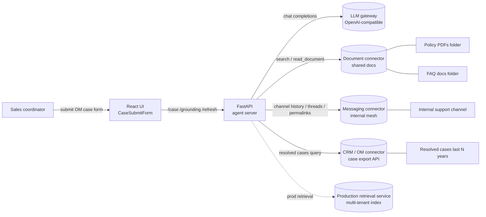

**Trust boundaries**

All external calls leave the agent process through confidential company-internal
connectors. Auth lives in the connectors and model gateway; the agent holds no
production secrets in `RETRIEVER_MODE = "fixture"` or `"local"`.

---

## 3. Container view (C4 — Level 2)

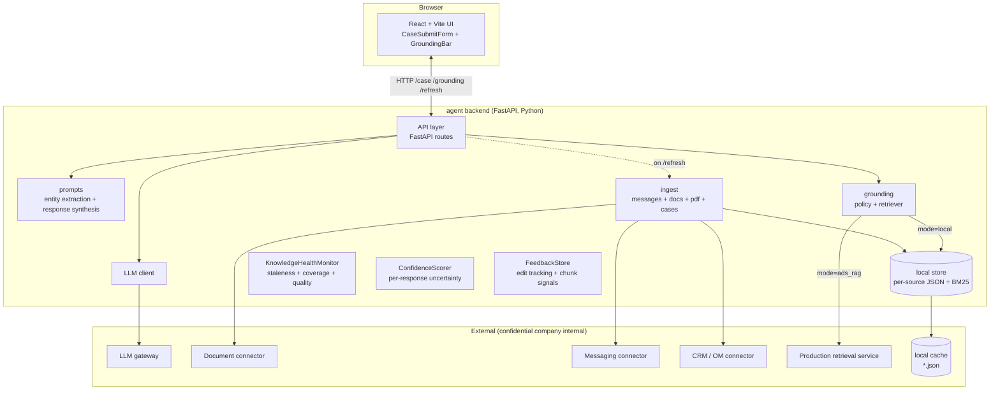

Three colour-coded loops (unchanged from v1):

| Loop             | Trigger                        | Latency budget  | Components touched                                               |
| ---------------- | ------------------------------ | --------------- | ---------------------------------------------------------------- |
| **Query**        | `POST /case`                   | < 5 s p95       | Server → Prompts → Retriever → ConfidenceScorer → LLM → Telemetry |
| **Ingest**       | 15-min tick or `POST /refresh` | seconds–minutes | Ingest → KnowledgeValidator → docs/messages/cases → Store       |
| **Telemetry**    | `GET /grounding` (UI polls)    | < 100 ms        | Server → in-memory `_last_grounding`                             |
| **Health**       | `GET /health/knowledge` (daily)| < 200 ms        | KnowledgeHealthMonitor → per-source staleness + quality report   |
| **Feedback**     | `POST /feedback` (per answer)  | < 50 ms         | FeedbackStore → feedback_store.jsonl → weekly penalty job        |

---

## 4. Component view (C4 — Level 3)

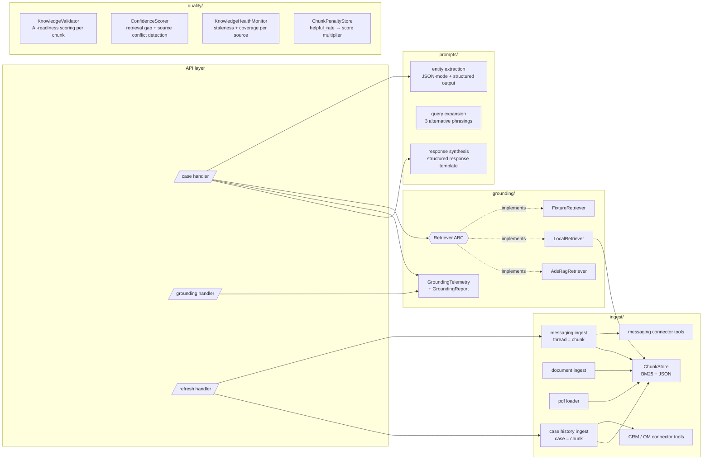

### Key contracts (updated)

- `Retriever.retrieve_one(request, source, top_k)` → `list[RetrievedChunk]`
  Per-source retrieval; blending happens in `Retriever.blended_retrieve`.
- `GroundingTelemetry.from_chunks(chunks)` → measures what actually got in.
- `ChunkStore(source).search(query, top_k)` → BM25 over a per-source JSON file;
  now four stores: `pdf_brd`, `slack`, `faq_gdoc`, **`case_history`**.

---

## 5. Query path — sequence

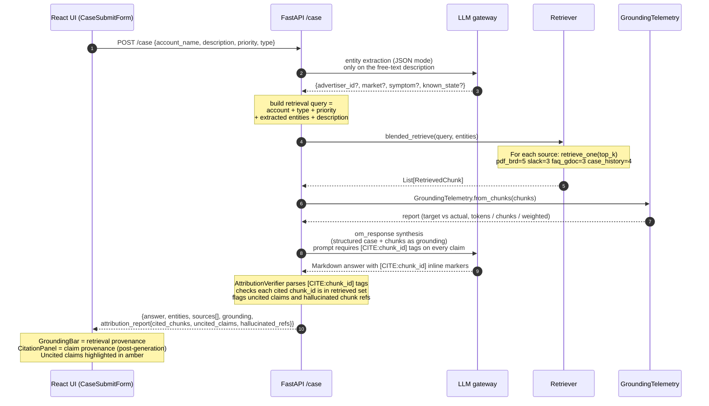

> **Provenance distinction (P1 review finding):** The GroundingBar measures
> *retrieval provenance* — what was supplied to the model. The CitationPanel
> and `attribution_report` measure *claim provenance* — what the model actually
> cited. Both are shown; neither is relabelled as the other. The audit log
> records both (see §12, §16.9).

Three LLM calls per turn (entity extraction + query expansion + synthesis) when
Phase 2 improvements are active; two in baseline mode. The extra call budget is
recovered by parallelising extraction and expansion (§15.2.3). The entity step mines the free-text
description for residual signals (`advertiser_id`, `market`, `symptom`,
`known_state`). For case history retrieval, `symptom` and `case_type` are
especially valuable signals: a `symptom` of `"delivery_blocked"` steers BM25
scoring directly toward historically similar resolved cases.

---

## 6. Ingestion path — sequence

### 6a. Messaging ingest (unchanged)

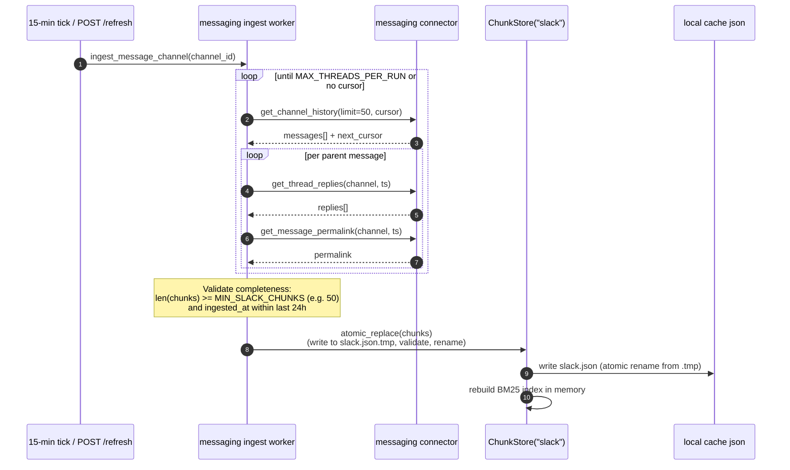

> **Atomic swap semantics (P2 review finding):** `replace_all` has been replaced
> with `atomic_replace`: the worker writes to a `.tmp` staging file, validates
> minimum cardinality and freshness, then renames atomically. If validation
> fails, the prior `.json` is retained and an alert fires. This prevents a
> partial upstream failure (connector timeout, truncated pagination) from
> publishing a degraded or empty index as the new truth.

### 6b. Case History ingest (new)

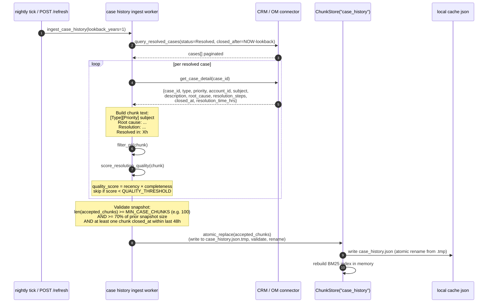

> **Snapshot validation rules:** Three checks must all pass before the atomic
> rename promotes the new snapshot:
> 1. **Absolute floor** — `len(accepted_chunks) >= MIN_CASE_CHUNKS`. Prevents
>    an empty CRM response from silently zeroing the store.
> 2. **Relative floor** — new snapshot must be ≥ 70% of the prior snapshot
>    size. Catches partial pagination failures where the connector returned a
>    valid but truncated result.
> 3. **Freshness check** — at least one chunk must have `closed_at` within the
>    last 48h. Catches a connector returning stale cached data.
> If any check fails, the prior `case_history.json` is kept, a health alert
> fires to the knowledge owner, and `KnowledgeHealthMonitor` sets
> `case_history.stale = true`.

**Chunking strategy for case history.** Each resolved case becomes one chunk,
preserving the symptom ↔ root-cause ↔ resolution triplet in a single retrieval
unit. Splitting a case across chunks would risk returning a symptom description
without its resolution — the same reasoning that drives thread-as-chunk for Slack.

**PII filtering before storage.** The `filter_pii` step strips or hashes
`account_id`, advertiser names, and any free-text advertiser identifiers from
the chunk text before writing to `case_history.json`.

> **Metadata retention constraint (P1 review finding):** `case_id` is retained
> as non-indexed metadata for UI deep-links. `account_id` is **not** retained
> in any form in `case_history.json` — it is stripped entirely at ingest time.
> Deep-links are constructed via `case_id` only; the CRM resolves account
> context at click time using the coordinator's own session scope, not from
> stored metadata. This closes the cross-account leak path that would otherwise
> exist if `account_id` were present in a locally-cached file visible to all
> `local` mode sessions. `test_pii_compliance.py` asserts `account_id` absence
> in `case_history.json` on every CI build (§16.6).

**Quality filtering.** A `quality_score` is computed as:

```
quality_score = recency_weight(closed_at) × completeness(root_cause, resolution_steps)
```

- `recency_weight`: cases closed in the last 90 days score 1.0; weight decays
  linearly to 0.5 at 12 months (configurable via `CASE_RECENCY_HALF_LIFE_DAYS`).
- `completeness`: 1.0 if both `root_cause` and `resolution_steps` are non-empty;
  0.5 if only one is present; 0.0 otherwise (chunk is dropped).

Cases below `QUALITY_THRESHOLD = 0.3` are skipped, preventing low-signal
"resolved by workaround — see account team" cases from diluting retrieval.

**Ingest cadence.** Case history runs on a **nightly tick** (not 15-min), because
CRM data changes on a daily resolution cycle and the dataset is larger than Slack.
A `/refresh?source=case_history` call can force a manual re-ingest.

---

## 7. Grounding policy & telemetry

The grounding policy is a *declared target* + *measured actual* + *tolerance*.

### 7a. Updated source weights

| Source           | v1 target | v2 target | Rationale                                                                         |
| ---------------- | --------- | --------- | --------------------------------------------------------------------------------- |
| `pdf_brd`        | 50%       | **40%**   | Still the most authoritative source; slightly reduced to make room for case history |
| `slack`          | 25%       | **20%**   | Recent channel signals; reduced proportionally                                    |
| `faq_gdoc`       | 25%       | **20%**   | Curated answers; reduced proportionally                                           |
| `case_history`   | —         | **20%**   | Historical resolved cases — empirical precedent for similar symptoms              |

> **v4 note — adaptive grounding:** The table above is the *default* target.
> The `AdaptiveGroundingPolicy` component (§16.5) can override these weights
> at query time when `ConfidenceScorer` signals that a source is low-coverage
> for the current case type. Static weights remain the fallback when confidence
> data is unavailable (fixture / cold-start modes).

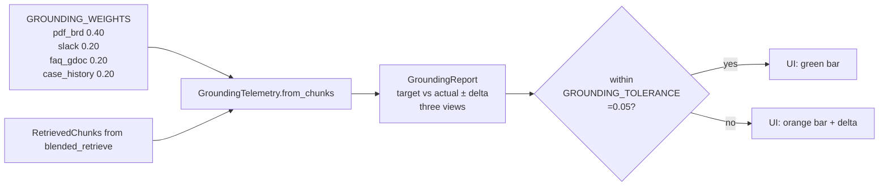

### 7b. Type-conditional weight overrides (recommended)

A fixed 40/20/20/20 split is not optimal for every case type. The case history
source is especially valuable for `Launch blocker` and `Order line` cases (high
volume of historical precedents), while policy PDFs dominate for `Billing` cases.

Recommended `GROUNDING_WEIGHTS_BY_TYPE` override map:

| Case type        | `pdf_brd` | `slack` | `faq_gdoc` | `case_history` |
| ---------------- | --------- | ------- | ---------- | -------------- |
| Launch blocker   | 0.35      | 0.20    | 0.15       | **0.30**       |
| Billing          | 0.55      | 0.10    | 0.20       | 0.15           |
| Order line       | 0.35      | 0.20    | 0.15       | **0.30**       |
| Creative review  | 0.30      | 0.15    | 0.35       | 0.20           |
| Other            | 0.40      | 0.20    | 0.20       | 0.20           |

These are initial recommendations to be tuned once the case history store
has been live for 30+ days and retrieval telemetry can be compared against
coordinator resolution times.

### 7c. Telemetry views (unchanged)

| View               | What it measures                         | When to trust                                |
| ------------------ | ---------------------------------------- | -------------------------------------------- |
| `tokens` (default) | Share of final prompt context per source | Most honest — this is what the LLM sees      |
| `chunks`           | Number of chunks per source              | Easier to explain to non-engineers           |
| `weighted`         | Σ(score × target\_weight) per source     | Useful for tuning retrieval                  |

`within_tolerance_tokens` is the single boolean the UI flips on when the live
mix is honoring the declared policy within ±5%.

---

## 8. Retriever modes & graceful degradation

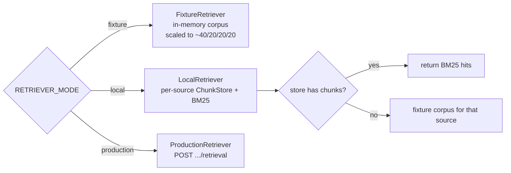

The fixture-fallback in `LocalRetriever` applies to all four sources including
`case_history`. During the rollout window before the CRM connector is wired,
case history falls back to a fixture corpus of ~20 synthetic resolved cases
scaled to the 20% target weight, so the grounding bar continues rendering
correctly.

`PER_SOURCE_TOP_K` updated:

```python
PER_SOURCE_TOP_K = {
    "pdf_brd":       5,   # was 6
    "slack":         3,
    "faq_gdoc":      3,
    "case_history":  4,   # new
}
```

Total chunks in context: **15** (was 12). The `pdf_brd` top-k is reduced by 1
to keep total prompt context growth modest while accommodating the new source.

---

## 9. Data model

```
classDiagram
    class RetrievedChunk {
      +chunk_id: str
      +source_type: SourceType
      +title: str
      +url: str
      +text: str
      +score: float
      +token_count: int
    }
    class StoredChunk {
      +chunk_id: str
      +source_type: SourceType
      +title: str
      +url: str
      +text: str
      +token_count: int
      +ingested_at: str
    }
    class CaseHistoryChunk {
      +chunk_id: str
      +source_type: SourceType = "case_history"
      +case_id: str
      +case_type: CaseType
      +priority: CasePriority
      +subject_anonymized: str
      +root_cause: str
      +resolution_steps: str
      +closed_at: datetime
      +resolution_time_hrs: float
      +quality_score: float
      +title: str
      +url: str
      +text: str
      +token_count: int
      +ingested_at: str
    }
    class ConfidenceSignal {
      +case_id: str
      +retrieval_gap: bool
      +max_chunk_score: float
      +min_chunk_score: float
      +source_conflict: bool
      +conflict_sources: list[SourceType]
      +low_confidence: bool
      +confidence_reason: str
    }
    class GroundingTelemetry {
      +target_weights: dict
      +chunks_by_source: dict
      +tokens_by_source: dict
      +weighted_score_by_source: dict
      +percentages(view) dict
      +deltas(view) dict
      +within_tolerance(view) bool
    }
    class GroundingReport {
      +target: dict
      +actual_tokens: dict
      +actual_chunks: dict
      +actual_weighted: dict
      +within_tolerance_tokens: bool
      +captured_at: datetime
    }

    StoredChunk --> RetrievedChunk : ChunkStore.search() projects
    CaseHistoryChunk --|> StoredChunk : extends
    RetrievedChunk --> GroundingTelemetry : from_chunks()
    GroundingTelemetry --> GroundingReport : from_telemetry()
```

`CaseHistoryChunk` extends `StoredChunk` with structured case metadata
(`case_id`, `case_type`, `closed_at`, `resolution_time_hrs`, `quality_score`).
These fields are carried through to `RetrievedChunk` as opaque metadata so the
synthesis prompt and UI citation panel can render: *"Resolved in 4.5h — see
Case #XXXXX"* without exposing raw `account_id`.

`SourceType` enum updated:

```python
class SourceType(str, Enum):
    PDF_BRD      = "pdf_brd"
    SLACK        = "slack"
    FAQ_GDOC     = "faq_gdoc"
    CASE_HISTORY = "case_history"   # new
```

---

## 10. Deployment view

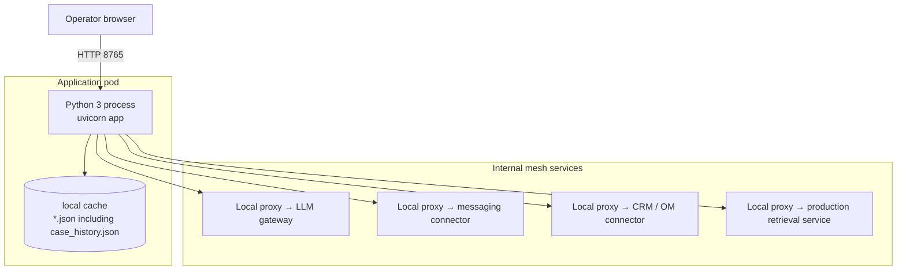

All confidential company-internal hops are reached via a local sidecar proxy.
The CRM connector follows the same proxy pattern as the messaging connector.

---

## 11. Failure modes & fallbacks

| Failure                                       | Detection                                               | Fallback                                                                                         |
| --------------------------------------------- | ------------------------------------------------------- | ------------------------------------------------------------------------------------------------ |
| LLM entity extraction returns non-JSON        | `json.JSONDecodeError`                                  | log + fall back to `{}` entities; retrieval still runs on form fields + description              |
| Required form field missing/empty             | Pydantic 422 on `CaseRequest`                           | UI surfaces field-level error; no LLM/retrieval call made                                        |
| LLM synthesis 5xx                             | `Exception` in synthesis                                | `HTTPException(502)` to caller — UI shows error toast                                            |
| Messaging connector error                     | tool returns `{"error": ...}`                           | log warning, skip that page; partial ingest fine                                                 |
| Slack store empty                             | `ChunkStore.search` returns `[]`                        | `LocalRetriever` falls back to fixture corpus for that source                                    |
| Document connector unimplemented              | stub returns `[]`                                       | BRD/FAQ falls back to fixture corpus                                                             |
| **CRM connector error during ingest**         | **`Exception` in `ingest_case_history`**                | **log warning, retain last successful `case_history.json`; stale data is better than no data**  |
| **CRM connector returns no resolved cases**   | **`len(cases) == 0` after filter**                      | **log warning, skip store replace (retain prior snapshot); alert if this persists > 2 days**    |
| **All case history chunks below quality threshold** | **`quality_score < QUALITY_THRESHOLD` for all** | **write empty store; `LocalRetriever` falls back to fixture corpus for `case_history`**         |
| **Case history store stale (> 48 h)**         | **`ingested_at` check on store load**                   | **UI shows staleness badge on case history bar segment; no auto-block**                          |
| Production retrieval not onboarded            | `ProductionRetriever` raises `NotImplementedError`      | refuse to start with `RETRIEVER_MODE = "production"` until onboarded                            |
| Grounding outside tolerance                   | `within_tolerance_tokens == False`                      | UI bar flips orange + shows ± delta; operator decides                                            |

---

## 12. Security & privacy

- **No raw advertiser id in external-facing drafts** — enforced in the
  `OM_RESPONSE_SYSTEM` prompt.
- **Case history PII handling** — `account_id` and advertiser names are stripped
  from the BM25-indexed chunk text during ingest (§6b). They are retained as
  non-indexed metadata solely for UI deep-links. The synthesis prompt is
  explicitly instructed not to reproduce metadata fields verbatim.
- **Case history access gating** — the CRM connector requires a separate
  approval scope (`case_history_read`). In `fixture` / `local` modes the
  connector is not called; flipping `RETRIEVER_MODE` without the approved scope
  is a no-op for `case_history` rather than a data leak.
- **No production credentials** in the agent process for `fixture` / `local` modes.
- **Logging** — message bodies and case descriptions are not logged; only counts,
  IDs, quality scores, and error reasons.
- **Cross-advertiser leakage prevention** — `ChunkStore` instances are isolated
  per retrieval scope. The CRM connector enforces `account_scope` on every query;
  a misconfigured scope returns an empty result set, not a cross-tenant result.
  This is validated in the integration test suite on every deploy.
- **Regulatory retention compliance** — case history ingest respects per-region
  retention limits via a `CASE_RETENTION_POLICY` config map:
  ```python
  CASE_RETENTION_POLICY = {
      "EU":  {"max_lookback_days": 365, "pii_fields": ["account_id", "contact_name", "email"]},
      "US":  {"max_lookback_days": 730, "pii_fields": ["account_id"]},
      "APAC":{"max_lookback_days": 365, "pii_fields": ["account_id", "contact_name"]},
  }
  ```
  The ingest worker filters cases by region tag before writing to `case_history.json`.
- **Audit log (required for regulated verticals)** — every `POST /case` response
  is written to an append-only audit record:
  ```json
  {
    "case_id": "...", "timestamp": "...", "model_version": "...",
    "chunk_ids_used": ["..."], "answer_hash": "...",
    "grounding_report": {...}, "coordinator_id_hash": "..."
  }
  ```
  Raw answer text is not stored — only its SHA-256 hash, sufficient for tamper
  detection. Full answer reconstruction requires the coordinator's submission
  log, preventing the audit store from becoming a PII sink.

  > **Audit log scope (P1 review finding):** `chunk_ids_used` records *retrieval*
  > provenance — what was supplied to the model. It does not on its own prove
  > claim-level provenance (what the model cited in the answer). The
  > `attribution_report.cited_chunks` field (written alongside `chunk_ids_used`)
  > provides claim-level provenance; together they constitute a defensible audit
  > trail. See §16.9 for the full attribution architecture.

---

## 13. Extension points

| Want to…                              | Change                                                                                                                                                                                                           |
| ------------------------------------- | ---------------------------------------------------------------------------------------------------------------------------------------------------------------------------------------------------------------- |
| Add a fifth source                    | Add to `SourceType` + `GROUNDING_WEIGHTS` + `PER_SOURCE_TOP_K`; implement `retrieve_one` for the new source; telemetry layer needs no changes.                                                                  |
| Change form fields                    | Edit `CaseRequest` in `server/schemas.py` + `CasePriority` / `CaseType` literals; mirror in `ui/src/types.ts` + `CaseSubmitForm.tsx`; update `_case_to_retrieval_query` if the field should influence retrieval. |
| Swap BM25 for embeddings (local)      | Replace `ChunkStore.search` body; `RetrievedChunk` shape is unchanged.                                                                                                                                           |
| Move to production retrieval          | Implement `ProductionRetriever.retrieve_one` against the production retrieval API; flip `RETRIEVER_MODE`.                                                                                                        |
| Stream responses to the UI            | Convert `/case` to SSE; `GroundingBar` already polls `/grounding` independently.                                                                                                                                 |
| Add a feedback loop                   | New `/feedback` endpoint that writes `{chunk_id, helpful_bool}`; feed into a re-rank layer above `Retriever`.                                                                                                   |
| **Extend case history lookback**      | **Increase `CASE_LOOKBACK_YEARS` env var (default `1`); re-run nightly ingest. Longer lookbacks require recency weight re-calibration (see §6b quality scoring).**                                            |
| **Filter case history by case type**  | **Add `CASE_HISTORY_TYPE_FILTER` env var (default `all`); pass as query param to CRM connector. Allows scoping the store to e.g. `Launch blocker` only for a focused deployment.**                             |
| **Surface resolution time in the UI** | **`CaseHistoryChunk.resolution_time_hrs` is already in the data model; expose it in the citation card component alongside the case deep-link.**                                                                 |
| **Re-rank case history by recency**   | **Add a `recency_boost` multiplier to `ChunkStore("case_history").search()` that scales BM25 scores by `recency_weight(closed_at)`. This lets the retriever prefer recent resolutions without a full embedding pipeline.** |
| **Per-source health dashboard**       | Expose `GET /health/knowledge` endpoint driven by `KnowledgeHealthMonitor`; surface in a new UI panel alongside the grounding bar. Shows: last ingest timestamp, chunk count, avg quality score, staleness flag per source. |
| **Confidence-gated UI**               | When `ConfidenceSignal.low_confidence = true`, UI renders the answer in an amber state with a "Low confidence — please verify" banner instead of the standard green. Coordinator must click "Acknowledged" before the answer can be sent. |
| **Multi-model judge rotation**        | Replace single LLM-as-judge call with a rotating ensemble of two models (e.g. GPT-4o + Claude Sonnet). Flag answers where judges disagree by > 1.0 on any dimension for human spot-check. Reduces single-model blind-spot risk. |
| **Knowledge owner notification**      | When `KnowledgeHealthMonitor` detects a source stale > SLA or chunk quality drop > 10%, send a notification to the named `source_owner` (from `SOURCE_OWNERSHIP_MAP` config) via the messaging connector. |

---

## 14. Open questions

1. **BRD freshness** — BRD PDFs change quarterly; do we want a "BRD updated"
   banner in the UI, surfaced from the document connector's `updated_at`?
2. **Messaging scope creep** — the support channel is high-volume. Do we want
   per-channel weights so we can add a second channel without re-tuning?
3. **Prod retrieval SLO** — what's the agreed p95 for `ProductionRetriever`? The
   current `< 5 s p95` query budget assumes ≤ 1 s for blended retrieval.
4. **Audit log** — every escalation eventually becomes a customer-facing answer.
   Do we persist `{query, entities, chunks_used, answer, grounding}` for review,
   and if so, where (object storage? CRM attachment?).
5. **Case history lookback window** — defaulting to 1 year. Should this be
   case-type-specific? (e.g., `Billing` patterns may be stable over 2–3 years;
   `Launch blocker` patterns may shift quarterly with platform changes.)
6. **Case history write-back** — when a coordinator resolves a new escalation
   using this agent, should the outcome be written back to the CRM as a resolved
   case, feeding the next ingestion cycle? This is explicitly out of scope for v1
   (read-only triage) but is the natural v2 flywheel.
7. **Quality threshold calibration** — `QUALITY_THRESHOLD = 0.3` is a starting
   point. Once the store is live, plot retrieval hit rate vs. threshold value
   across 30 days of production traffic to find the Pareto-optimal threshold.
8. **Confidence threshold calibration** — `ConfidenceScorer.low_confidence`
   currently triggers when `max_chunk_score < 0.4` or `source_conflict = true`.
   What is the right threshold to minimize false positives (amber banner on a
   good answer) while catching genuine low-confidence cases?
9. **Knowledge owner SLA** — what is the maximum acceptable staleness per source
   before coordinators should be warned? Proposed: BRD 30 days, FAQ 14 days,
   Slack 1 day, Case History 2 days. Requires ops sign-off.
10. **Multi-LLM judge cost** — running two judge calls per golden-set evaluation
    doubles eval cost. Is this acceptable, or should we run dual-judge only on
    flagged / low-scoring answers?

---

## 15. AI Response Quality Improvement Strategy

This section defines *how the agent gets better over time* — not just how it
works on day one. It is structured as three overlapping phases, each with
concrete implementation steps, measurable success criteria, and explicit
tie-ins to the existing architecture.

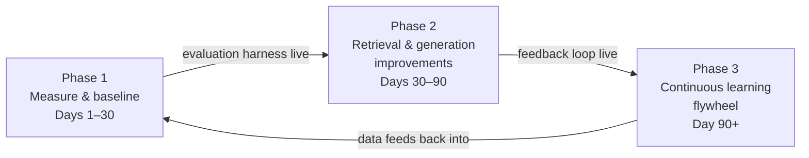

The phases are intentionally sequential in their *dependencies* but can run in
parallel in practice: Phase 1 instrumentation must land before Phase 2 tuning
is meaningful; Phase 2 feedback infrastructure must land before Phase 3
retraining is possible.

---

### 15.1 Phase 1 — Measure & Baseline (Days 1–30)

> You cannot improve what you cannot measure. Before touching retrieval or
> prompts, instrument everything and establish a ground truth.

#### 15.1.1 Golden evaluation set

Build a set of **30–50 manually curated (case description → expected answer
attributes)** pairs, drawn from real past escalations. Each golden example
captures:

| Field                    | Description                                                  |
| ------------------------ | ------------------------------------------------------------ |
| `case_description`       | Real or lightly anonymized coordinator input                 |
| `expected_sources`       | Which source types should appear in the answer (`pdf_brd`, `case_history`, etc.) |
| `expected_entities`      | `{symptom, case_type, market}` the extractor should find    |
| `must_contain`           | Key facts that must appear in the answer (e.g. "creative approval required") |
| `must_not_contain`       | Facts that should never appear (e.g. raw account names, hallucinated policy numbers) |
| `resolution_path`        | The correct fix path in plain language — used for LLM-as-judge scoring |

Run this set on every code change via a CI evaluation job. A regression is any
drop of > 3 percentage points on the composite score (see §15.1.3).

#### 15.1.2 Retrieval evaluation metrics

For each golden example, measure:

| Metric                  | Definition                                                           | Target    |
| ----------------------- | -------------------------------------------------------------------- | --------- |
| **Recall@K**            | Fraction of expected source types present in top-K retrieved chunks  | ≥ 0.85    |
| **MRR** (Mean Reciprocal Rank) | How high the first relevant chunk ranks per query             | ≥ 0.70    |
| **Grounding adherence** | `within_tolerance_tokens` (already in §7) across all golden cases   | ≥ 90%     |
| **Entity extraction accuracy** | F1 on `{symptom, case_type, market}` vs. golden labels      | ≥ 0.80    |

These metrics run against the existing `GroundingTelemetry` output and the
`RetrievedChunk` list — no new infrastructure is required.

#### 15.1.3 Generation evaluation metrics

Use an **LLM-as-judge** call (a separate synthesis evaluation prompt, not the
main synthesis prompt) to score each generated answer against its golden
`resolution_path`. Score on a 1–5 rubric:

| Dimension          | What it tests                                                           |
| ------------------ | ----------------------------------------------------------------------- |
| **Factual accuracy** | Does the answer contradict any retrieved source or the golden resolution? |
| **Completeness**   | Are all required fix steps present?                                     |
| **Citation fidelity** | Does every cited fact map to a real retrieved chunk?                 |
| **Conciseness**    | Is the answer free of repetition and padding?                           |
| **Tone**           | Does it read as a professional coordinator response?                    |

Composite score = weighted average (accuracy × 0.35, completeness × 0.25,
citation fidelity × 0.20, conciseness × 0.10, tone × 0.10). Minimum
acceptable composite: **3.8 / 5.0**.

#### 15.1.4 Production telemetry baseline

Before any improvements land, record 30-day baseline values for:

- Median / p95 end-to-end latency (`POST /case`)
- Actual grounding mix per case type (from `GroundingReport`)
- Entity extraction fallback rate (how often `entities == {}`)
- Coordinator edit rate (% of answers modified before sending — requires a
  lightweight edit-tracking hook in the UI, see §15.2.5)

---

### 15.2 Phase 2 — Retrieval & Generation Improvements (Days 30–90)

Each improvement below has a **dependency** (what must be true before you start),
an **implementation note** tied to the existing architecture, and a **success
criterion** expressed as a delta on a Phase 1 baseline metric.

#### 15.2.1 Hybrid retrieval: BM25 + dense embeddings

**Dependency:** Phase 1 evaluation harness live.

**Problem:** BM25 misses semantic synonyms. A coordinator writing *"ads won't
serve"* won't hit a BRD chunk that says *"delivery blocked pending creative
review"* — same problem, different words.

**Implementation:**

1. Add an embedding model call (e.g. `text-embedding-3-small`) in
   `ChunkStore.search()` alongside the existing BM25 path.
2. Run both independently; merge ranked lists using **Reciprocal Rank Fusion
   (RRF)**: `score_rrf = Σ 1 / (k + rank_i)` where `k = 60`.
3. No change to `RetrievedChunk` shape or `GroundingTelemetry`.

```python
# ChunkStore.search() — hybrid path
def search(self, query: str, top_k: int) -> list[RetrievedChunk]:
    bm25_hits  = self._bm25_search(query, top_k * 2)
    dense_hits = self._dense_search(query, top_k * 2)   # new
    return _reciprocal_rank_fusion(bm25_hits, dense_hits)[:top_k]
```

**Success criterion:** Recall@K improves by ≥ 5 pp on the golden set vs. BM25-only baseline.

#### 15.2.2 Query expansion before retrieval

**Dependency:** None (can run in parallel with 15.2.1).

**Problem:** A coordinator's one-sentence description rarely uses the exact
vocabulary of the policy PDFs or historical cases. Query expansion bridges this
gap before retrieval happens, not after.

**Implementation:** Add a third LLM call — *before* `blended_retrieve` — that
expands the retrieval query into 3 alternative phrasings:

```
System: You are a query expansion assistant for an ad ops support system.
Given a case description, return a JSON array of 3 alternative search queries
that express the same problem using different vocabulary — policy language,
technical terms, and symptom descriptions.
Output only the JSON array.
```

Run retrieval against all 4 queries (original + 3 expansions), union the
results, de-duplicate by `chunk_id`, re-rank by max score. This adds ~200ms
latency but is parallelisable with the entity extraction call (see §15.2.3).

**Success criterion:** MRR improves by ≥ 0.05 on the golden set.

#### 15.2.3 Parallel LLM calls (latency recovery)

**Dependency:** 15.2.2 (adds a third LLM call that would otherwise be serial).

**Problem:** v1 runs entity extraction → retrieval → synthesis serially. With
query expansion added, the naive path is 3 serial LLM calls before synthesis
even starts.

**Implementation:** Run entity extraction and query expansion **in parallel**
using `asyncio.gather`:

```python
entity_task   = asyncio.create_task(extract_entities(description))
expansion_task = asyncio.create_task(expand_query(description, case_type))
entities, expansions = await asyncio.gather(entity_task, expansion_task)
# Then build retrieval query from both, run blended_retrieve, then synthesis
```

Both calls are narrow (JSON mode, < 200 token outputs), so they complete in
~400ms in parallel vs. ~800ms serial. Net cost of adding query expansion: ~0ms
on wall clock.

**Success criterion:** p95 latency ≤ 5s even with query expansion active.

#### 15.2.4 Cross-encoder re-ranking

**Dependency:** 15.2.1 hybrid retrieval live.

**Problem:** Hybrid retrieval returns the top-15 chunks by score, but "top by
score" is not the same as "most useful for this specific case." A cross-encoder
re-ranker scores each (query, chunk) pair jointly, catching relevance signals
that bi-encoder retrieval misses.

**Implementation:**

1. After `blended_retrieve` returns top-15, pass all 15 (query, chunk) pairs
   to a cross-encoder (e.g. Cohere Rerank API, or a local `cross-encoder/ms-marco-MiniLM-L-6-v2`).
2. Re-sort by cross-encoder score; keep the top 12 (respecting `PER_SOURCE_TOP_K`
   minimums per source to preserve grounding policy).
3. `GroundingTelemetry` runs on the final 12 — no change needed there.

**Success criterion:** LLM-as-judge factual accuracy score improves by ≥ 0.2
points (composite) on the golden set vs. pre-reranking.

#### 15.2.5 Coordinator edit tracking (feedback signal)

**Dependency:** Phase 1 baseline coordinator edit rate measured.

**Problem:** The agent has no signal on whether its answers are actually good.
Every time a coordinator edits the answer before sending it to the advertiser,
that edit is a free supervised signal — and currently it is discarded.

**Implementation:**

1. In the UI, wrap the answer display in a `<textarea>` (editable) rather than
   rendered markdown. On submit, diff `original_answer` vs. `submitted_answer`.
2. `POST /feedback` with:
   ```json
   {
     "case_id": "...",
     "chunk_ids_used": ["...", "..."],
     "original_answer": "...",
     "submitted_answer": "...",
     "edit_distance_ratio": 0.12,
     "coordinator_id_hash": "..."
   }
   ```
3. Server writes to `feedback_store.jsonl` (append-only). `edit_distance_ratio`
   is the fraction of characters changed. If > 0.3, the response is flagged as
   "substantially edited" — a strong negative signal.

**Success criterion:** Edit tracking live and capturing data within 2 weeks of
Phase 2 start. Target: coordinator edit rate < 25% at end of Phase 2.

#### 15.2.6 Synthesis prompt hardening

**Dependency:** Phase 1 LLM-as-judge scoring baseline.

**Problem:** The synthesis prompt controls what the LLM does with the retrieved
chunks. Small prompt changes can have large effects on citation fidelity and
hallucination rate.

**Improvements to the `OM_RESPONSE_SYSTEM` prompt:**

| Technique | What to add | Why |
|---|---|---|
| **Explicit grounding instruction** | "Base your answer *only* on the provided source chunks. If a chunk does not support a claim, do not make it." | Reduces hallucination |
| **Citation format enforcement** | "After every factual claim, add a citation in the format `[Source: <source_type>, chunk <chunk_id>]`." | Improves citation fidelity scoring |
| **Contradiction instruction** | "If two chunks contradict each other, surface both positions and note the conflict rather than picking one silently." | Prevents silent hallucination when policy chunks disagree |
| **Resolution path structure** | "Structure your answer as: (1) Likely root cause, (2) Recommended fix steps, (3) Escalation path if fix steps do not resolve." | Improves completeness score |
| **Negative instruction** | "Do not include account names, advertiser IDs, or any PII. Do not speculate beyond the provided sources." | Reinforces PII protection from §12 |

**Success criterion:** Citation fidelity dimension of LLM-as-judge composite
improves by ≥ 0.3 points vs. baseline.

---

### 15.3 Phase 3 — Continuous Learning Flywheel (Day 90+)

> Phase 3 turns the agent from a static system into a self-improving one.
> It requires the feedback infrastructure from §15.2.5 to be live and
> accumulating data.

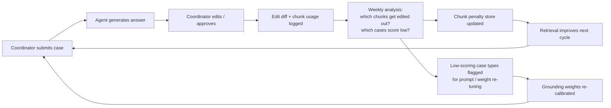

#### 15.3.1 Chunk penalty store

**How it works:** After 30 days of feedback data, run a weekly job:

```python
# For each chunk_id, compute:
# helpful_rate = (approvals where chunk was used) / (total uses)
# If helpful_rate < PENALTY_THRESHOLD (= 0.3):
#   write chunk_id → penalty_multiplier to penalty_store.json
# ChunkStore.search() multiplies BM25/dense score by penalty_multiplier
```

Chunks that are consistently retrieved but then edited out get a score
penalty. Chunks that are retrieved and kept verbatim get a small score boost.
No retraining required — this is a post-retrieval score adjustment only.

**Review cadence:** Weekly automated job; monthly human review of the penalty
store to confirm penalties are semantically sensible (not just rare queries
gaming the stats).

#### 15.3.2 Case-type weight re-calibration

**How it works:** The type-conditional grounding weights in §7b are initial
estimates. After 90 days of production data, recalibrate using actual outcomes:

```
For each case_type:
  actual_edit_rate_by_source = mean(edit_distance_ratio grouped by primary_source_type)
  new_weight[source] ∝ 1 - actual_edit_rate_by_source[source]
```

Sources whose chunks are consistently kept by coordinators get weight
increases; sources whose chunks are consistently edited out get weight
decreases. Re-calibration runs quarterly and requires a human sign-off before
the new `GROUNDING_WEIGHTS_BY_TYPE` config is deployed.

#### 15.3.3 Automated regression detection

**How it works:** Run the golden evaluation set (§15.1.1) nightly in CI. If
composite score drops > 3 pp from the rolling 7-day average:

1. Block the current deploy from promoting to production.
2. File an automatic incident ticket with the diff of the last changed
   prompt / config / ingest run.
3. Page the on-call engineer with the failing golden examples.

This prevents silent regressions from prompt changes, ingest data quality
shifts (e.g. a bad BRD PDF update), or LLM gateway model version changes.

#### 15.3.4 Case history write-back (v2 flywheel)

**Dependency:** §14 open question #6 resolved; CRM write permission approved.

**How it works:** When a coordinator submits an answer (edited or approved),
write a structured resolution record back to the CRM:

```json
{
  "source_case_id": "...",
  "agent_answer_hash": "...",
  "coordinator_edit_ratio": 0.08,
  "chunks_used": ["brd_chunk_003", "case_history_chunk_019"],
  "resolution_confirmed": true,
  "closed_at": "2026-07-15T14:32:00Z"
}
```

This record is then picked up by the next nightly `ingest_case_history` run,
creating a compounding flywheel: each resolved escalation enriches the case
history store, which improves retrieval for the next similar case.

**Safeguard:** Only write back cases where `coordinator_edit_ratio < 0.2` —
heavily-edited answers are not reliable enough to serve as future training
examples.

---

### 15.4 Quality improvement roadmap summary

| Phase | Initiative | Owner | Metric target | Timeline |
|---|---|---|---|---|
| 1 | Golden evaluation set + CI job | Eng | Harness live | Day 7 |
| 1 | LLM-as-judge scoring pipeline | Eng | Composite baseline captured | Day 14 |
| 1 | Production telemetry baseline | Eng | Edit rate + latency baseline | Day 30 |
| 2 | Hybrid retrieval (BM25 + dense) | Eng | Recall@K ≥ 0.85 | Day 45 |
| 2 | Query expansion (parallel) | Eng | MRR ≥ 0.70 | Day 45 |
| 2 | Cross-encoder re-ranking | Eng | Factual accuracy +0.2 pts | Day 60 |
| 2 | Coordinator edit tracking | Eng + PM | Edit rate baseline captured | Day 50 |
| 2 | Synthesis prompt hardening | Eng | Citation fidelity +0.3 pts | Day 40 |
| 3 | Chunk penalty store | Eng | Retrieval quality stable or improving | Day 100 |
| 3 | Case-type weight re-calibration | Eng + Ops | Edit rate < 20% | Day 120 |
| 3 | Automated regression detection | Eng | Zero silent regressions | Day 90 |
| 3 | Case history write-back | Eng + Legal | Flywheel active | Day 150 |

**North star metric:** Coordinator edit rate < 15% at Day 180, meaning 85% of
agent answers are sent to advertisers without modification. This is the single
number that best captures whether the AI response quality is fit for purpose.

---

## 16. Production Challenge Mitigations

This section translates the eight risks in §1 into concrete architectural and
process controls. Each subsection maps directly to a risk register entry (R1–R8).

---

### 16.1 Knowledge AI-Readiness Pipeline (R1)

> **Risk:** Policy PDFs, FAQs, Slack threads, and CRM notes are written for
> humans. 40–60% of source content is typically too low-signal for useful
> retrieval without pre-processing. Building the retrieval pipeline first and
> cleaning knowledge later is the most common root cause of failed RAG projects.

**Mitigation: Pre-ingest AI-readiness validation**

Every chunk passes through a `KnowledgeValidator` before being written to its
`ChunkStore`. The validator scores each candidate chunk across four dimensions:

| Dimension | Test | Score |
|---|---|---|
| **Completeness** | Does the chunk contain a subject + predicate? (not just a heading or page number) | 0–1 |
| **Actionability** | Does it describe a state, cause, or step? (not "see appendix A") | 0–1 |
| **Freshness signal** | Does it contain date references that may be stale? (flag, don't block) | flag |
| **Ambiguity** | Does it rely on pronouns / implicit context that loses meaning out of document order? | 0–1 |

Composite `readiness_score = 0.4 × completeness + 0.4 × actionability + 0.2 × (1 - ambiguity)`.
Chunks below `READINESS_THRESHOLD = 0.5` are rejected and written to a
`rejected_chunks.jsonl` log for the knowledge owner to review.

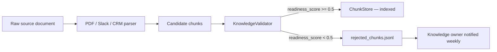

**Source-specific pre-processing rules:**

*BRD PDFs:*
- Strip headers, footers, page numbers, and table-of-contents entries before chunking.
- Split at section boundaries (detected by font-size change or `##`-equivalent markup), not at fixed token count.
- Flag chunks containing phrases like "TBD", "to be confirmed", "see section X" — these are likely incomplete.

*FAQ (shared docs):*
- Enforce Q&A pair integrity: keep the question and its answer in the same chunk.
  A question chunk without an answer body scores 0 on actionability and is rejected.
- Flag answers containing version-specific language ("as of Q2 2024") for staleness review.

*Slack threads:*
- Strip reaction emojis, @mentions, and bot messages before BM25 indexing.
- Reject threads where the final message is a question (unresolved thread = no resolution signal).
- Promote threads where a coordinator explicitly writes "resolved:" or "fix:" — these score +0.2 on actionability.

*Case history (CRM):*
- Existing quality scoring from §6b (`recency × completeness`) is the primary filter.
- Additionally: reject cases where `resolution_steps` contains only "escalated to engineering"
  or similar meta-resolutions with no actionable coordinator steps.

**Knowledge health report:**

`KnowledgeHealthMonitor` aggregates validator output into a per-source health
report, surfaced at `GET /health/knowledge` and on a new UI panel:

```json
{
  "sources": {
    "pdf_brd": {
      "total_chunks": 240, "accepted": 218, "rejected": 22,
      "rejection_rate": 0.092, "avg_readiness_score": 0.74,
      "last_ingested": "2026-06-05T02:00:00Z", "stale": false
    },
    "case_history": {
      "total_chunks": 890, "accepted": 521, "rejected": 369,
      "rejection_rate": 0.415, "avg_readiness_score": 0.58,
      "last_ingested": "2026-06-06T01:00:00Z", "stale": false
    }
  }
}
```

A `rejection_rate > 0.30` on any source triggers a knowledge owner notification
via the messaging connector (see §13 extension points). This is the earliest
possible signal that a source's data quality is degrading.

---

### 16.2 Retrieval Precision on Edge Cases (R2)

> **Risk:** The 20% of escalations that are rare, high-priority, and novel
> retrieve poorly from BM25 — precisely because they are rare. These are
> disproportionately the *Critical* cases where a wrong answer causes the most
> damage.

**Mitigation: Priority-aware retrieval boosting**

When `CaseRequest.priority = "Critical"` or `"High"`, the retrieval path
applies two additional signals:

1. **Priority boost on case history:** `ChunkStore("case_history").search()`
   applies a `priority_boost = 1.3` multiplier to chunks from cases that were
   also `Critical` or `High` priority. Critical cases historically resolved
   by similar symptoms are the most relevant precedents.

2. **Broader top-K with stricter re-ranking:** For Critical cases, `PER_SOURCE_TOP_K`
   is temporarily doubled (e.g. `pdf_brd = 10` instead of 5), and the
   cross-encoder re-ranker (§15.2.4) selects the final 15. This trades ~300ms
   latency for significantly better recall on rare patterns. The 5s p95 budget
   still holds because Critical cases are < 5% of volume.

3. **Fallback to full-text search hint:** If `max_chunk_score < 0.35` after
   re-ranking (all chunks are low-confidence), the `ConfidenceScorer` sets
   `retrieval_gap = true`. The UI renders a "No strong match found — recommend
   manual escalation path" hint alongside the answer, rather than presenting a
   low-confidence answer as authoritative.

---

### 16.3 Feedback Cold-Start Bootstrap (R3)

> **Risk:** The Phase 3 flywheel (§15.3) requires 200–500 real interactions
> before chunk penalty signals are statistically meaningful. At < 50 cases/day,
> that is months away. Without a bootstrap strategy, the system does not improve
> during its most critical early-adoption window.

**Mitigation: Three-layer bootstrap**

**Layer 1 — Pre-labelled golden set as synthetic feedback (Day 0):**
The 30–50 golden examples from §15.1.1 each have `must_contain` and
`must_not_contain` annotations. Treat these as 50 synthetic "coordinator
approvals" for the chunks they reference and 50 synthetic "coordinator
rejections" for irrelevant chunks retrieved during golden-set evaluation.
Seed `feedback_store.jsonl` with these synthetic signals before go-live.
This gives the chunk penalty store a non-zero baseline from Day 1.

**Layer 2 — Expert annotation sprint (Week 1–2):**
Run a structured 2-day annotation session with 3–5 senior coordinators.
Present them with 50 real past cases (not in the golden set) and ask them
to rate the agent's answer as "would send / would edit / would not use."
For "would edit" cases, capture the edit. This produces ~150 high-quality
feedback records before any real traffic.

**Layer 3 — Targeted explicit signal (not universal mandatory):**
Universal mandatory feedback on every submission produces low-effort, low-information
labels that bias the feedback store toward a spurious "helpful" baseline.

> **Revised design (P2 review finding):** The 3-option selector is shown
> *selectively*, not on every submission:
> - **Always shown:** when `ConfidenceSignal.low_confidence = true` (amber state).
>   These are exactly the cases where label quality matters most.
> - **Always shown:** when `edit_distance_ratio > 0.30` (coordinator substantially
>   rewrote the answer). The coordinator is already engaged; the extra click is low cost.
> - **Sampled:** 1-in-5 random sample of all other submissions, to collect
>   signal on normal cases without fatiguing coordinators.
> - **Never shown:** on Critical-priority cases mid-resolution. Speed is the
>   priority; feedback is collected post-resolution via the "Report inaccuracy"
>   flow (§16.4c).

The selector is framed as "Help us improve: was this answer accurate?" — not
as blocking the submission. It appears *after* the submit button, not before,
so it cannot be perceived as a gate. The `feedback_source` field in
`feedback_store.jsonl` records whether each record is `selective`, `sampled`,
or `implicit_edit`, allowing downstream analysis to weight record types independently
and flag if selective-trigger labels diverge from sampled ones (a signal that
the triggering criteria are themselves introducing bias).

---

### 16.4 Coordinator Adoption & Trust Design (R4)

> **Risk:** Over-reliance leads to unreviewed wrong answers reaching advertisers.
> Under-reliance means coordinators do not use the tool and resolution time does
> not improve. The "it got it wrong once" event can permanently damage trust.
> These are product design problems, not engineering ones.

**Design principles (each maps to a UI decision):**

**4a. Calibrated confidence display, not binary good/bad.**
The answer is never presented as "the answer." It is presented as "a suggested
response, grounded in these sources." The grounding bar is always visible.
When `ConfidenceSignal.low_confidence = true`, an amber "Low confidence" banner
replaces the green state, and the coordinator must click "Acknowledged" before
the answer can be sent. This forces a moment of deliberate review on uncertain
cases without creating friction on high-confidence ones.

**4b. Source citations are primary, not decorative.**
Every factual claim in the answer links to the source chunk it came from. The
citation is a first-class UI element (clickable, expandable), not a footnote.
Coordinators who can verify a claim against its source develop calibrated trust
faster than those shown only an answer.

**4c. Graceful wrong-answer recovery.**
When a coordinator substantially edits the answer (`edit_distance_ratio > 0.3`),
the UI offers a one-click "Report inaccuracy" flow that captures:
- Which part of the answer was wrong (free text, < 200 chars)
- Which source chunk was the problem (multi-select from chunks used)

This makes wrong answers a data collection event rather than a trust-destroying
dead end, and gives the team actionable signal for knowledge curation.

**4d. Progressive rollout by case type.**
Start with `Other` and low-priority cases (lowest stakes, highest tolerance for
imperfect answers). Expand to `Order line`, then `Creative review`, then
`Launch blocker`, then `Billing` (highest policy sensitivity). Each expansion
gate requires the prior type's coordinator edit rate to be < 30% for 2 weeks.
This ensures coordinators experience the tool as "getting better" rather than
"sometimes wrong on important things."

**4e. Workflow integration — not a tab switch.**
The case-submit form must be embedded within or directly adjacent to the
coordinator's primary CRM view. A standalone tool that requires a browser tab
switch will be abandoned within 2 weeks of launch. The preferred integration
point is a CRM sidebar panel that auto-populates the form fields from the
active case record.

---

### 16.5 Adaptive Grounding Policy (R5)

> **Risk:** Fixed grounding weights optimize for declared governance intent but
> can fight actual answer quality when the best answer is heavily concentrated
> in one source. A `Billing` case that is 100% in BRD PDFs wastes context
> window retrieving 20% from Slack and case history.

**Mitigation: `AdaptiveGroundingPolicy`**

`AdaptiveGroundingPolicy` is a thin wrapper around the existing `GroundingTelemetry`
that adjusts `top_k` per source at query time based on two signals:

```python
class AdaptiveGroundingPolicy:
    def adjusted_top_k(
        self,
        base_weights: dict[SourceType, float],
        confidence: ConfidenceSignal,
        case_type: CaseType,
        store_sizes: dict[SourceType, int],
    ) -> dict[SourceType, int]:
        # Start from a mutable copy; never mutate the caller's dict
        weights = dict(TYPE_WEIGHT_OVERRIDES.get(case_type, base_weights))

        # Step 1 — zero out under-populated sources; collect freed weight
        freed = 0.0
        for source in list(weights):
            if store_sizes.get(source, 0) < MIN_STORE_SIZE_FOR_WEIGHT:
                freed += weights.pop(source)

        # Step 2 — redistribute freed weight to pdf_brd (authoritative fallback)
        weights["pdf_brd"] = weights.get("pdf_brd", 0) + freed

        # Step 3 — apply conflict boost, then re-normalise to preserve budget
        if confidence.source_conflict:
            weights["pdf_brd"] = min(weights["pdf_brd"] * 1.2, 0.70)

        # Step 4 — normalise so weights sum to exactly 1.0
        total = sum(weights.values())
        weights = {src: w / total for src, w in weights.items()}

        # Step 5 — integer allocation: largest-remainder method
        # guarantees sum(top_k.values()) == TOP_K_TOTAL exactly
        raw = {src: TOP_K_TOTAL * w for src, w in weights.items()}
        floors = {src: int(v) for src, v in raw.items()}
        remainder = TOP_K_TOTAL - sum(floors.values())
        # Distribute leftover slots to sources with largest fractional parts
        by_frac = sorted(raw, key=lambda s: raw[s] - floors[s], reverse=True)
        for src in by_frac[:remainder]:
            floors[src] += 1
        # Enforce per-source minimum of 1 for active sources
        return {src: max(1, v) for src, v in floors.items()}
```

> **Fix note (P1 review finding):** The previous version mutated `base_weights`
> in place, applied a capped boost without renormalising, and used `round()` on
> independent weights — all of which could produce `sum(top_k) != TOP_K_TOTAL`.
> The revised version uses largest-remainder integer allocation, guaranteeing
> the total budget is preserved exactly across all adaptive branches.

Three adaptive behaviours:

1. **Store-size gating:** If a source has < `MIN_STORE_SIZE_FOR_WEIGHT` (20)
   chunks — e.g. case history is empty on a fresh deploy — its quota is
   reallocated to `pdf_brd` rather than silently returning low-quality chunks.
2. **Source conflict resolution:** When `ConfidenceScorer` detects that two
   retrieved chunks contradict each other, `pdf_brd` weight is boosted (up to
   0.70 cap) because policy PDFs are the authoritative tie-breaker. The
   conflict is also surfaced in the answer via the synthesis prompt (§15.2.6).
3. **Type-conditional fallback:** Uses the `GROUNDING_WEIGHTS_BY_TYPE` table
   from §7b; falls back to default weights if `case_type = "Other"`.

`GroundingTelemetry` still measures and reports the *actual* mix — adaptive
policy changes `top_k` inputs, not the telemetry measurement. Governance
visibility is preserved.

---

### 16.6 PII & Compliance Controls (R6)

> **Risk:** Case history retrieval is the highest-risk PII surface in the
> system. Cross-advertiser leakage, GDPR/CCPA violations, and audit gaps are
> each independently severe. (Detailed controls are in §12; this section
> describes the *enforcement architecture*.)

**Mitigation: Three enforcement layers**

**Layer 1 — Ingest-time stripping (§6b, §12):**
PII fields are stripped before `case_history.json` is written. This is the
primary control. The `filter_pii()` function is the only place in the codebase
that touches raw `account_id` and `contact_name` values.

**Layer 2 — Query-time scope enforcement:**
`ChunkStore("case_history").search()` accepts a mandatory `retrieval_scope` parameter.

> **Local mode constraint (P1 review finding):** Local mode may **only** ingest
> from fixture data or a sanitized synthetic dataset — never from a real CRM
> export. This is enforced by:
> 1. `RETRIEVER_MODE = "local"` sets `CRM_CONNECTOR = "disabled"` at startup;
>    `ingest_case_history` raises `RuntimeError` if called while the connector
>    is disabled.
> 2. The `case_history.json` fixture ships with synthetic cases only (no real
>    `case_id` values). CI validates this with a fixture integrity check.
> 3. `retrieval_scope = "internal"` is only valid when the store was seeded from
>    fixtures. The scope string is written into `case_history.json` header at
>    ingest time; `ChunkStore` rejects a search with `retrieval_scope = "internal"`
>    if the store header indicates it was built from a real CRM source.

In production mode, `retrieval_scope = session.account_scope` (CRM connector
enforces row-level filtering). A missing `retrieval_scope` argument raises
`ValueError` — it cannot be forgotten by accident.

```python
def search(self, query: str, top_k: int, retrieval_scope: str) -> list[RetrievedChunk]:
    if retrieval_scope is None:
        raise ValueError("retrieval_scope is required for case_history ChunkStore")
    if retrieval_scope == "internal" and self._store_source != "fixture":
        raise ValueError("retrieval_scope='internal' is only valid for fixture stores")
    ...
```

**Layer 3 — Audit log (§12):**
Every response is written to the append-only audit log with `answer_hash` and
`chunk_ids_used`. The audit log is the compliance artifact — it proves what
information the AI used to generate each customer-facing answer, without storing
the raw answer text.

**Compliance test suite:** A dedicated `test_pii_compliance.py` runs on every
CI build and verifies:
- No `account_id` strings appear in any chunk in `case_history.json`.
- `retrieval_scope` is passed in all `ChunkStore("case_history").search()` call sites.
- The audit log write succeeds on every `POST /case` path (including error paths).

---

### 16.7 Evaluation Harness Maintenance Protocol (R7)

> **Risk:** The golden evaluation set becomes stale as policy changes, making
> CI regressions meaningless (false positives on changed-but-correct answers)
> or missing real regressions (because the golden answer is now wrong).

**Mitigation: Structured golden set lifecycle**

**Quarterly golden set review (mandatory):**
Each quarter, the golden set owner (Operations lead + one senior coordinator)
runs a structured review:
1. Flag any `must_contain` assertions that reference policy details changed in
   the last quarter (e.g. SLA times, creative approval windows).
2. Update affected golden examples. Treat this as a code change — PR review
   required, tracked in version control.
3. Add 5–10 new golden examples from high-edit-rate cases in production
   (cases where `edit_distance_ratio > 0.3` are the best candidates for golden
   set additions).
4. Retire golden examples older than 18 months unless the policy they test is
   confirmed still current.

**Dual-model judge rotation:**
Run LLM-as-judge scoring with two different model families (e.g. GPT-4o +
Claude Sonnet). Flag answers where the two judges disagree by > 1.0 on any
dimension — these are cases where the rubric itself may be ambiguous, not just
the answer. Route flagged cases to human spot-check rather than counting them
toward the composite score.

**Judge calibration sessions (quarterly, alongside golden set review):**
Present 10 the same answers to both the LLM judges and 3 human coordinators.
Measure inter-rater agreement (target: Cohen's κ > 0.6). If human-LLM agreement
drops below this threshold, update the judge rubric prompt before the next
quarter's evaluation run.

---

### 16.8 Org & Process Controls (R8)

> **Risk:** Technical systems degrade when no human is accountable for their
> inputs. Knowledge ownership gaps, CRM data quality drift, cross-team
> dependencies, and model version instability each silently erode response
> quality in ways that the engineering team cannot observe or fix alone.

**Mitigation: Four org-level controls**

**8a. Named knowledge owners with SLA:**

| Source | Owner role | Staleness SLA | On breach |
|---|---|---|---|
| `pdf_brd` | Product Operations lead | 30 days | `KnowledgeHealthMonitor` notifies owner + PM |
| `faq_gdoc` | Operations team lead | 14 days | Same |
| `slack` | Support coordinator lead | 1 day | Automated alert; auto-fallback to fixture |
| `case_history` | CRM admin | 2 days | Same as Slack |

Ownership is declared in `SOURCE_OWNERSHIP_MAP` config and is a required field
before each source can be promoted to production mode.

**8b. CRM data quality process change:**
The single highest-leverage process change for case history quality is requiring
coordinators to fill `root_cause` and `resolution_steps` fields before a case
can be marked `Resolved` in the CRM. This is a CRM workflow change (mandatory
fields), not an agent change. Without it, `rejection_rate` for `case_history`
will stay above 40% indefinitely (see §16.1 health report).

**8c. Model version change protocol:**
Any LLM gateway model version upgrade (e.g. `gpt-4o-2024-11-20` → `gpt-4o-2025-03-15`)
must trigger:
1. A full golden-set evaluation run against the new model version.
2. A composite score comparison (new vs. previous). If delta > −3 pp, the
   upgrade is blocked pending investigation.
3. An update to `MODEL_VERSION` in the audit log config so historical records
   remain attributable to the correct model version.

**8d. Cross-team dependency register:**
The agent depends on three connector teams (Document, Messaging, CRM) and the
LLM gateway team. Each dependency is registered with:
- Named contact per team
- SLA for connector availability (target: 99.5% uptime)
- Escalation path if connector is down > 15 minutes
- Change notification requirement (connector teams must notify 48h before
  breaking API changes)

This register lives in the project's shared ops runbook, not in this design
document — but its existence is a project completion criterion before
production launch.

---

### 16.9 Attribution Architecture — Retrieval vs Claim Provenance (P1 finding)

> **Root issue:** The design previously conflated two distinct provenance
> guarantees: (a) which chunks were *retrieved and supplied* to the model, and
> (b) which chunks the model actually *cited in its answer*. The grounding bar
> measures (a). Claim-level attribution requires a separate post-generation step.

**Two-layer provenance model:**

| Layer | What it measures | Where surfaced | In audit log |
|---|---|---|---|
| **Retrieval provenance** | Which chunks were in the prompt context | GroundingBar (existing) | `chunk_ids_used` |
| **Claim provenance** | Which chunks the model cited per factual claim | CitationPanel (new) | `attribution_report.cited_chunks` |

**`AttributionVerifier` — post-generation step:**

The synthesis prompt (§15.2.6) is updated to require `[CITE:chunk_id]` inline
markers after every factual claim:

```
System addition: After every factual claim, append a citation in the format
[CITE:chunk_id] where chunk_id is the ID of the retrieved chunk that supports
the claim. If no retrieved chunk supports a claim, do not make it.
```

After synthesis, `AttributionVerifier` parses the raw model output:

```python
class AttributionVerifier:
    def verify(
        self,
        raw_answer: str,
        retrieved_chunks: list[RetrievedChunk],
    ) -> AttributionReport:
        retrieved_ids = {c.chunk_id for c in retrieved_chunks}
        cited_ids     = set(re.findall(r"\[CITE:([^\]]+)\]", raw_answer))

        hallucinated_refs = cited_ids - retrieved_ids   # cited but not retrieved
        uncited_claims    = _extract_factual_claims(raw_answer) - cited_ids  # claims with no cite

        return AttributionReport(
            cited_chunks      = cited_ids & retrieved_ids,
            hallucinated_refs = hallucinated_refs,
            uncited_claims    = uncited_claims,
            provenance_clean  = not hallucinated_refs and not uncited_claims,
        )
```

**UI rendering:**

- `[CITE:chunk_id]` markers are stripped from the displayed answer and replaced
  with numbered superscript footnotes that link to the citation panel.
- Claims with no cite tag are highlighted in amber with a "Source not cited" tooltip.
- Hallucinated chunk references (model cited a chunk_id not in the retrieved set)
  trigger a red "Invalid citation" badge and are logged as a model quality event.

**Audit log update (§12):**

```json
{
  "chunk_ids_used":       ["brd_003", "case_012", "faq_007"],
  "attribution_report": {
    "cited_chunks":       ["brd_003", "case_012"],
    "hallucinated_refs":  [],
    "uncited_claims":     1,
    "provenance_clean":   false
  },
  "answer_hash": "sha256:..."
}
```

`chunk_ids_used` (retrieval provenance) and `attribution_report.cited_chunks`
(claim provenance) are recorded separately and explicitly labelled — neither is
described as "proving" the other's property.

**Governance posture (answer to open question):**

The peer review asked: *"Do you want source provenance to mean retrieval
provenance or claim-level answer provenance?"*

**Answer:** Both, labelled distinctly. Retrieval provenance (GroundingBar) serves
the declared governance requirement of measurable source mix. Claim provenance
(CitationPanel + `attribution_report`) serves the defensible attribution
requirement for customer-facing answers. The two are complementary and are never
conflated in the UI, the audit log, or the API response schema.
